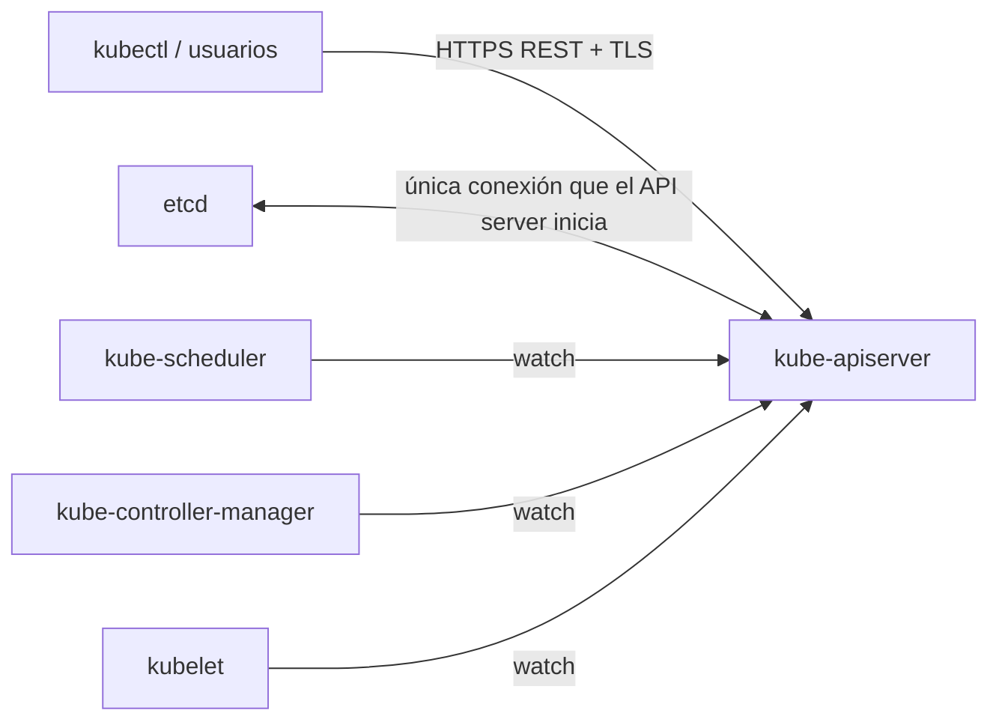

# kube-apiserver

## Rol

El **kube-apiserver** es el centro del clúster y el único punto de entrada a la API de Kubernetes. Todos los accesos al clúster —usuarios finales, componentes internos, sistemas de monitorización y servicios de terceros— pasan por él.

Cuando se utiliza `kubectl`, en el fondo se está comunicando con el API server mediante peticiones HTTP REST sobre TLS. Asimismo, la comunicación entre el API server y los demás componentes del clúster ocurre sobre TLS para impedir accesos no autorizados.

## Responsabilidades

### Gestión de API

- Expone el endpoint de la API del clúster y atiende todas las peticiones.
- La API está **versionada** y soporta varias versiones simultáneamente (`/v1`, `/apis/apps/v1`, etc.).

### Autenticación y autorización

- **Autenticación**: certificados de cliente, tokens bearer y autenticación HTTP Basic.
- **Autorización**: evaluación ABAC y RBAC.

### Procesamiento y validación de peticiones

- Valida los datos de los objetos de la API (Pods, Services, etc.).
- Aplica **admission controllers** de mutación y validación antes de persistir los objetos.

### Coordinación

- Coordina todos los procesos entre los componentes del plano de control y los nodos trabajadores.

### Extensiones

- Incluye una **capa de agregación** (`Aggregation Layer`) que permite extender la API de Kubernetes para crear recursos y controladores personalizados (CRD + controllers).

## Conexiones y observación (watch)

- **Único componente al que el API server inicia conexión**: `etcd`.
- Todos los demás componentes (kubelet, scheduler, controladores) **se conectan al API server** y establecen *watches* sobre recursos: reciben notificaciones en tiempo real cuando un recurso se crea, modifica o elimina.
- Cada componente observa el API server de forma independiente para determinar qué debe hacer.

## API server proxy

El API server incluye un **proxy integrado** dentro de su propio proceso. Reenvía peticiones hacia recursos del clúster; está pensado principalmente para fines administrativos y de depuración, **no** para exponer aplicaciones hacia el exterior.

## Consideraciones de seguridad

La superficie de ataque del clúster se reduce en gran medida asegurando el API server. Un experimento de la Shadowserver Foundation descubrió alrededor de **380 000 API servers de Kubernetes accesibles públicamente**, lo que evidencia la importancia de:

- Restringir el acceso de red al puerto de la API (6443/tcp por defecto).
- Usar certificados PKI para todas las comunicaciones.
- Implementar RBAC con el menor privilegio posible.
- Auditar los admission controllers habilitados.

## Resumen

| Aspecto | Detalle |
| --- | --- |
| Función | Puerta de entrada única y gestión de la API de Kubernetes |
| Protocolo | HTTP REST sobre TLS |
| Autenticación | Certificados de cliente, bearer tokens, HTTP Basic |
| Autorización | ABAC, RBAC |
| Conexión saliente única | `etcd` |
| Mecanismo de sincronización | Watch sobre recursos |
| Extensibilidad | Capa de agregación (CRDs y controladores personalizados) |

**Ver también**: [10-objetos-y-recursos.md](10-objetos-y-recursos.md) (objetos y recursos), [16-extensiones.md](16-extensiones.md) (admission controllers y extensión de la API), [17-kubeconfig.md](17-kubeconfig.md) (acceso de clientes).