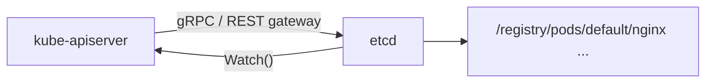

# etcd

## Rol

Kubernetes es un sistema distribuido y necesita una base de datos distribuida eficiente que soporte su naturaleza. **etcd** actúa como la **fuente única de verdad** del clúster: todos los objetos de Kubernetes, configuraciones y metadatos se almacenan aquí.

## ¿Qué es etcd?

etcd es un **almacén clave-valor distribuido, de código abierto y fuertemente consistente**.

| Característica | Implicación |
| --- | --- |
| **Fuertemente consistente** | Una actualización en un nodo se propaga inmediatamente al resto del clúster. (Según el teorema CAP, no es posible tener 100 % de disponibilidad junto con consistencia fuerte y tolerancia a particiones). |
| **Distribuido** | Diseñado para ejecutarse en múltiples nodos como clúster sin sacrificar consistencia. |
| **Clave-valor** | Base de datos no relacional que almacena datos como pares clave-valor y expone una API de clave-valor. Está construido sobre **bbolt** (fork de BoltDB). |

Para lograr consistencia fuerte y disponibilidad utiliza el **algoritmo de consenso Raft**, que funciona de forma líder-miembro (*leader-member*) para soportar alta disponibilidad y resistir fallos de nodos.

## Cómo se integra con Kubernetes

- Cuando se consulta un objeto con `kubectl get …`, los datos provienen de etcd (a través del API server).
- Cuando se despliega un objeto (p. ej. un Pod), se crea una entrada en etcd.

## Claves para entender etcd

- Almacena todas las configuraciones, estados y metadatos de los objetos de Kubernetes: Pods, Secrets, DaemonSets, Deployments, ConfigMaps, StatefulSets, etc.
- Expone la API `Watch()`: permite a los clientes suscribirse a eventos. El API server usa esa funcionalidad para rastrear los cambios de estado de los objetos.
- Expone API clave-valor mediante **gRPC**; el **gateway gRPC** actúa como proxy RESTful que traduce las llamadas HTTP a mensajes gRPC. Esto lo convierte en una base de datos ideal para Kubernetes.
- Todos los objetos se almacenan bajo la clave `/registry`. Por ejemplo, la información de un Pod llamado `nginx` en el namespace `default` está en `/registry/pods/default/nginx`.

## Ubicación en el clúster

- es el único componente **StatefulSet** del plano de control.
- En clústeres basados en `kubeadm` suele ejecutarse como un **Pod estático** gestionado por el kubelet durante el bootstrap del clúster.

## Qué pasa si etcd cae

- Las aplicaciones en ejecución **no se ven afectadas** de inmediato.
- No es posible crear ni actualizar objetos sin un etcd funcional: el clúster queda en modo "solo lectura" respecto al estado deseado.

## Resumen

| Aspecto | Detalle |
| --- | --- |
| Tipo | Almacén clave-valor distribuido y fuertemente consistente |
| Consenso | Algoritmo Raft (líder-miembro) |
| Acceso | API gRPC + gateway RESTful |
| Watch | API `Watch()` para suscripción a eventos |
| Raíz de datos | `/registry` |
| Almacenamiento subyacente | bbolt (fork de BoltDB) |
| En kubeadm | Pod estático gestionado por kubelet |