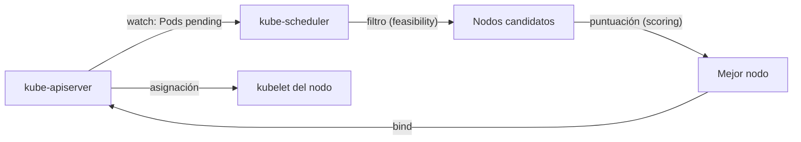

# kube-scheduler

## Rol

El **kube-scheduler** es el responsable de **asignar (schedulear) los Pods a los nodos trabajadores** del clúster. No crea los Pods ni los contenedores: decide *dónde* debe ejecutarse cada Pod.

## Cómo funciona

Al desplegar un Pod se especifican sus requisitos:

- CPU y memoria (requests/limits)
- Afinidad y anti-afinidad
- Taints y tolerations
- Prioridad
- Volúmenes persistentes (PV)
- Requisitos de dispositivos especializados (DRA)

La tarea principal del scheduler es **detectar la petición de creación** (el Pod en estado *Pending*) y elegir el **mejor nodo** que satisfaga los requisitos.

## Fases del scheduling

1. **Filtrado (feasibility)**: se descartan los nodos que no cumplen los requisitos del Pod (recursos insuficientes, taints no tolerados, afinidad no satisfecha, etc.).
2. **Puntuación (scoring)**: se ordenan los nodos candidatos según políticas (balance de recursos, localidad de datos, etc.).
3. **Binding**: se registra la asignación del Pod al nodo ganador en el API server; el kubelet del nodo destino lo detecta y procede a crear los contenedores.

## Scheduling consciente de hardware (DRA)

Para hardware especializado (GPUs, FPGAs, smart NICs) el scheduler puede usar **Dynamic Resource Allocation (DRA)**:

- Estable en Kubernetes desde **v1.34**.
- Proporciona al scheduler información **real** sobre los dispositivos de hardware del clúster.
- Con DRA habilitado, el scheduler puede hacer scheduling consciente del hardware para dispositivos especializados, particularmente útil para cargas de trabajo **IA/ML**.

## Resumen

| Aspecto | Detalle |
| --- | --- |
| Función | Elegir el nodo óptimo para cada Pod |
| Entrada | Requisitos del Pod (recursos, afinidad, taints, prioridad, PV) |
| Proceso | Filtrado → puntuación → binding |
| Hidratación | Observed los Pods *Pending* vía watch del API server |
| Hardware especializado | DRA (estable desde v1.34) habilita scheduling consciente del hardware |