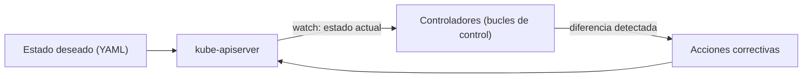

# kube-controller-manager

## Rol

El **kube-controller-manager** (KCM) es el componente que **gestiona todos los controladores integrados** de Kubernetes. Los recursos/objetos de Kubernetes (Pods, Namespaces, Jobs, ReplicaSets, etc.) son gestionados por sus controladores respectivos.

## ¿Qué es un controlador?

> En Kubernetes, los controladores son bucles de control que observan el estado del clúster y luego realizan o solicitan los cambios necesarios. Cada controlador intenta acercar el estado actual del clúster al estado deseado.

Los controladores son **programas que ejecutan bucles de control infinitos**: corren continuamente, observan el estado **actual** y el **deseado** de los objetos, y si hay diferencia, actúan para que el recurso cumpla el estado deseado.

### Ejemplo con un Deployment

1. Se define el estado deseado en un manifiesto YAML (enfoque declarativo): 2 réplicas, un volume mount, un ConfigMap, etc.
2. El **deployment controller** integrado garantiza que el Deployment esté siempre en el estado deseado.
3. Si un usuario actualiza el Deployment a 5 réplicas, el controlador lo detecta y asegura que el estado deseado sea 5 réplicas.

## Controladores integrados principales

| Controlador | Recurso que gestiona |
| --- | --- |
| Deployment controller | Deployments |
| ReplicaSet controller | ReplicaSets |
| DaemonSet controller | DaemonSets |
| Job controller | Jobs |
| CronJob controller | CronJobs |
| Endpoints controller | Endpoints / EndpointSlices |
| Namespace controller | Namespaces |
| Service Accounts controller | ServiceAccounts |
| Node controller | Estado de los nodos |

## Puntos clave

- Gestiona todos los controladores; los controladores intentan mantener el clúster en el **estado deseado**.
- Kubernetes es **extensible** con **controladores personalizados** asociados a *Custom Resource Definitions* (CRDs): se pueden implementar lógicas de negocio que observen recursos propios.

## Resumen

| Aspecto | Detalle |
| --- | --- |
| Función | Gestionar los controladores integrados de Kubernetes |
| Mecanismo | Bucles de control infinitos (estado actual vs. estado deseado) |
| Enfoque | Declarativo (manifiestos YAML definen el estado deseado) |
| Ejemplo | Deployment controller escala réplicas según el manifiesto |
| Extensibilidad | Controladores personalizados sobre CRDs |

**Ver también**: [12-workloads.md](12-workloads.md) (objetos gestionados: Deployment, ReplicaSet, DaemonSet, etc.), [16-extensiones.md](16-extensiones.md) (custom controllers y Operators).