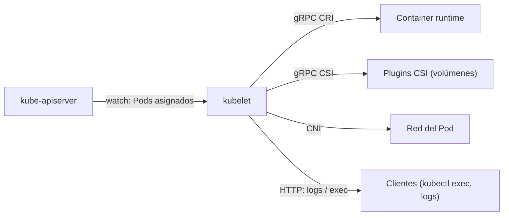

# kubelet

## Rol

El **kubelet** es el agente que se ejecuta en **cada nodo** del clúster. A diferencia de los contenedores, **no corre como contenedor**: se ejecuta como daemon gestionado por `systemd`.

Sus funciones principales:

- Registrar el nodo ante el API server.
- Observar los Pods asignados a ese nodo.
- Cuando se asigna un Pod, hablar con el container runtime para crear, actualizar o eliminar contenedores de modo que coincidan con el estado deseado.

## Responsabilidades

- **Ciclo de vida de contenedores**: crear, modificar y eliminar los contenedores del Pod.
- **Probes**: gestionar las sondas de *liveness*, *readiness* y *startup*.
- **Volúmenes**: leer la configuración del Pod y crear los directorios correspondientes en el host para los volume mounts.
- **Reporte de estado**: recolectar y reportar el estado de nodos y Pods al API server, mediante implementaciones como `cAdvisor` y CRI.
- **Static Pods**: gestionar Pods definidos localmente en el nodo (no pasan por la API de Kubernetes). En clústeres `kubeadm`, los componentes del plano de control corren como Static Pods durante el bootstrap.

## Interfaces que utiliza

| Interfaz | Protocolo | Uso |
| --- | --- | --- |
| **CRI** (Container Runtime Interface) | gRPC | Comunicación con el container runtime (crear, iniciar, detener contenedores) |
| **CSI** (Container Storage Interface) | gRPC | Configuración de volúmenes de bloque |
| **CNI** (Container Network Interface) | — | Asignación de IP al Pod, rutas de red y reglas de firewall |
| HTTP endpoint | — | Streaming de logs (`kubectl logs`) y sesiones exec (`kubectl exec`) |

## Red del Pod

El kubelet usa el **plugin CNI configurado en el clúster** para:

- Asignar la dirección IP del Pod.
- Configurar las rutas de red necesarias.
- Aplicar las reglas de firewall del Pod.

## Escalado en caliente (in-place pod resize)

A partir de Kubernetes **v1.35 (GA)**, el kubelet puede ajustar los *requests* y *limits* de CPU y memoria de un Pod **mientras se está ejecutando**, frecuentemente sin reiniciar el contenedor, como parte de la función de *in-place pod resize*.

## Resumen

| Aspecto | Detalle |
| --- | --- |
| Función | Agente de nodo: gestiona el ciclo de vida de los contenedores |
| Ejecución | Daemon gestionado por systemd (no corre como contenedor) |
| Interfaz principal | CRI (gRPC) con el container runtime |
| Otras interfaces | CSI (volúmenes), CNI (red), HTTP (logs/exec) |
| Static Pods | Pods definidos localmente, usados para el bootstrap del plano de control |
| Destacado | In-place pod resize desde v1.35 (GA) |