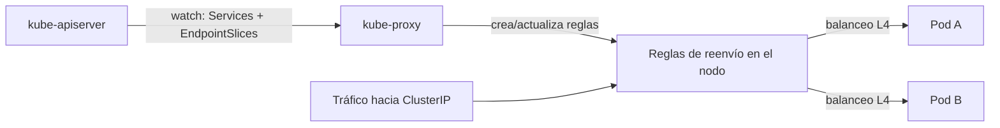

# kube-proxy

## Rol

**kube-proxy** es el daemon que implementa el **concepto de Service de Kubernetes** en el plano de datos de cada nodo: servicio de descubrimiento con una IP/ DNS única para un conjunto de Pods y **balanceo de carga a nivel L4**. Se ejecuta en cada nodo como un DaemonSet y trabaja principalmente con protocolos **UDP, TCP y SCTP** — no entiende HTTP (eso es L7, propio del Gateway API).

## Conceptos previos necesarios

- **Service**: forma de exponer un conjunto de Pods interna o externamente. Al crear el objeto Service se le asigna una **IP virtual** llamada `ClusterIP`, accesible solo dentro del clúster. La `ClusterIP` no es "pingable": se usa únicamente para descubrimiento de servicios, a diferencia de las IP de los Pods.
- **EndpointSlices**: almacenan las IP y puertos de los Pods que respaldan a un Service. El **EndpointSlice controller** las crea y actualiza automáticamente a medida que los Pods aparecen o desaparecen. Así el Service sabe a qué Pods backend enviar el tráfico.

## Cómo funciona

1. kube-proxy consulta al API server la información del Service (ClusterIP) y las IP/puertos de los Pods asociados.
2. Observa (**watch**) Services y EndpointSlices vía el API server.
3. Ante cualquier cambio, **actualiza las reglas de reenvío** en el nodo.

## Modos de operación

### iptables (modo por defecto)

- El tráfico se gestiona mediante reglas de iptables.
- Por cada Service se crean reglas que capturan el tráfico dirigido a la ClusterIP y lo reenvían a los Pods backend.
- El backend se elige **aleatoriamente** para el balanceo; una vez establecida la conexión, las peticiones van al mismo Pod hasta que la conexión termina.

### nftables

- Aborda las limitaciones de **rendimiento y escalabilidad** de iptables, típicamente en clústeres grandes con miles de Services.

## ¿Es obligatorio? (por qué figura como "opcional")

Las **CNI modernas implementan su propio reenvío de paquetes y lógica de balanceo**, equivalente a la de kube-proxy. En ese caso, la red de Kubernetes sigue funcionando **sin** kube-proxy.

Ejemplo clásico: **Cilium** (CNI basada en eBPF) gestiona el tráfico de los Services (ClusterIP, NodePort, LoadBalancer) directamente con eBPF en el kernel de Linux, sin depender de las reglas de iptables/nftables que usa kube-proxy.

## L4 vs. L7 en el enrutado de Kubernetes

| Nivel | Mecanismo | Ejemplo |
| --- | --- | --- |
| **L4** | El objeto Service enruta por IP y puerto | Service ClusterIP, NodePort, LoadBalancer |
| **L7** | El Gateway API enruta por detalles HTTP (path, host) | HTTPRoute, GRPCRoute |

## Resumen

| Aspecto | Detalle |
| --- | --- |
| Función | Implementar Services: descubrimiento y balanceo L4 |
| Protocolos | UDP, TCP, SCTP (sin HTTP) |
| Fuente de datos | Watch de Services y EndpointSlices vía API server |
| Modos | iptables (default), nftables |
| Alternativa | CNI con eBPF (p. ej. Cilium) puede reemplazarlo por completo |
| ClusterIP | IP virtual, solo para descubrimiento, no pingable |

**Ver también**: [13-services.md](13-services.md) (el objeto Service), [14-ingress-y-gateway-api.md](14-ingress-y-gateway-api.md) (ruteo L7).