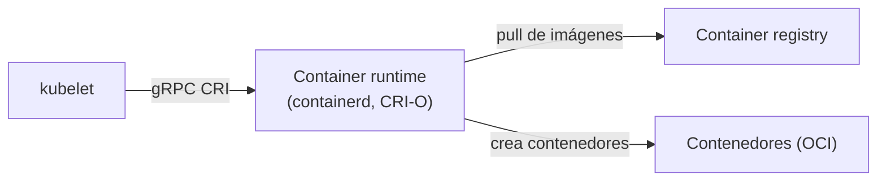

# Container Runtime

## Rol

El **container runtime** es el software requerido para ejecutar contenedores en un host (análogo al rol del JRE para programas Java). Corre en **todos los nodos** del clúster y es responsable de:

- Descargar imágenes desde los registries de contenedores.
- Ejecutar contenedores.
- Asignar y aislar recursos de los contenedores.
- Gestionar el ciclo de vida completo de un contenedor en el host (crear, iniciar, detener, eliminar).

## Dos conceptos fundamentales

### Container Runtime Interface (CRI)

- Conjunto de **APIs** que permiten a Kubernetes interactuar con distintos container runtimes.
- Permite usar diferentes runtimes de forma **intercambiable** con Kubernetes.
- Define la API para crear, iniciar, detener y eliminar contenedores, además de la gestión de imágenes y de las redes de contenedores.

### Open Container Initiative (OCI)

- Conjunto de **estándares** para formatos de contenedores y runtimes.
- Garantiza interoperabilidad: las imágenes y los runtimes que cumplen OCI son portables entre implementaciones.

## Runtimes compatibles

Kubernetes soporta runtimes compatibles con CRI:

- **containerd**
- **CRI-O**
- Otros runtimes que implementen la Container Runtime Interface

> **Nota**: si se usa Docker Engine, se requiere un adaptador CRI externo como **cri-dockerd**.

## Cómo lo usa Kubernetes

El **kubelet** es quien interactúa con el container runtime mediante las **APIs CRI** para gestionar el ciclo de vida de los contenedores. Además, obtiene toda la información de los contenedores desde el runtime y la reporta al plano de control.

## Resumen

| Aspecto | Detalle |
| --- | --- |
| Función | Ejecutar y gestionar el ciclo de vida de los contenedores |
| Interfaz con Kubernetes | CRI (gRPC), gestionada por el kubelet |
| Estándar de formatos | OCI (imágenes y runtimes interoperables) |
| Ejemplos | containerd, CRI-O (Docker requiere cri-dockerd) |
| Tareas | Pull de imágenes, ejecución, asignación/aislamiento de recursos, ciclo de vida |