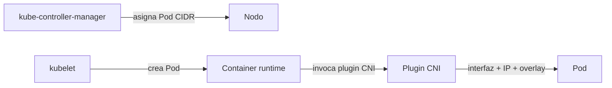

# Componentes adicionales (addons)

Además de los componentes centrales, un clúster de Kubernetes necesita **añadidos (addons)** para estar plenamente operativo. La elección de cada uno depende de los requisitos del proyecto.

| Addon | Función |
| --- | --- |
| **CNI plugin** | Red de Pods, políticas de red |
| **CoreDNS** | Servidor DNS, descubrimiento de servicios por DNS |
| **Metrics Server** | Métricas de recursos de nodos y Pods |
| **Web UI (Dashboard)** | Gestión de objetos mediante interfaz web |
| **CSI node plugins** | Configuración de almacenamiento |

## CNI Plugin

### ¿Qué es CNI?

La **Container Network Interface (CNI)** es una arquitectura basada en plugins con **especificaciones y librerías neutrales de proveedor** para crear interfaces de red para contenedores.

No es específica de Kubernetes: estandariza el networking de contenedores en distintas herramientas de orquestación (Kubernetes, Mesos, CloudFoundry, Podman, Docker, etc.).

Los distintos proveedores de red crearon soluciones basadas en CNI con capacidades variadas (aislamiento, seguridad, cifrado), lo que permite elegir la solución que mejor se adapte a cada caso.

### Cómo trabaja el CNI con Kubernetes

1. El `kube-controller-manager` asigna un **CIDR de Pods** a cada nodo. Cada Pod obtiene una IP única de ese rango.
2. Cuando el kubelet pide al container runtime crear un Pod, el runtime invoca el **plugin CNI configurado**.
3. El plugin CNI crea la interfaz de red del Pod, asigna la IP y lo conecta a la red del clúster.
4. El plugin CNI gestiona la comunicación entre Pods, estén en el mismo nodo o en nodos distintos, típicamente mediante una **red overlay (overlay network)**.

### Funcionalidades que proveen los plugins CNI

- **Pod networking**: conectividad de los Pods en el clúster.
- **Network Policies**: seguridad y aislamiento de la red de Pods para controlar el flujo de tráfico entre Pods y entre namespaces.

### Plugins CNI populares

| Plugin | Característica |
| --- | --- |
| **Calico** | Networking y políticas de red |
| **Flannel** | Overlay simple y liviano |
| **Cilium** | Basado en eBPF |
| **Amazon VPC CNI** | Para AWS VPC |
| **Azure CNI** | Para Azure Virtual Network |

## CoreDNS

- Actúa como **servidor DNS dentro del clúster**.
- Habilita el **descubrimiento de servicios por DNS**: los Pods resuelven los nombres de los Services (`<service>.<namespace>.svc.cluster.local`) sin conocer las IPs.

## Metrics Server

- Recolecta **datos de rendimiento y uso de recursos** de nodos y Pods.
- Alimenta comandos como `kubectl top` y el **HPA (Horizontal Pod Autoscaler)**.

## Web UI (Kubernetes Dashboard)

- Interfaz web para **gestionar los objetos del clúster** (deployments, Services, etc.) sin usar `kubectl`.

## CSI node plugins

- Implementan la **Container Storage Interface** en los nodos para **configurar almacenamiento** (volúmenes persistentes de distintos proveedores).

## Resumen

| Addon | Propósito principal |
| --- | --- |
| CNI | Red de Pods y Network Policies |
| CoreDNS | DNS y descubrimiento de servicios |
| Metrics Server | Métricas de recursos (kubectl top, HPA) |
| Dashboard | Gestión por interfaz web |
| CSI | Almacenamiento persistente |