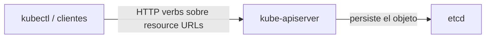

# Objetos y recursos de Kubernetes

## Objeto vs. recurso

### Objeto

Un **objeto** es una entidad persistida en el clúster que representa el **estado deseado** del sistema. Es creado y gestionado por el API server y se almacena en `etcd`.

Ejemplos de objetos: Pods, Services, Deployments.

### Recurso

Un **recurso** es la representación de un objeto expuesta por la API de Kubernetes. Es la vía por la que los clientes interactúan y manipulan los objetos.

Un recurso se corresponde con una **URL específica de la API** y se accede mediante verbos HTTP (`GET`, `POST`, `DELETE`, etc.):

- `/api/v1/pods` → lista de objetos Pod v1.
- `/api/v1/namespaces/<namespace>/pods/<pod-name>` → un Pod individual dentro de un namespace.



## Estructura YAML de un objeto

Cada objeto se representa/crea con un archivo YAML. Los más de 20 objetos nativos de Kubernetes siguen la misma estructura jerárquica:

```yaml
apiVersion: <versión de la API>
kind: <tipo de objeto>
metadata:
  name: <nombre del objeto>
spec:
  <especificación del objeto>
```

| Sección | Significado |
| --- | --- |
| **apiVersion** | Versión de la API de Kubernetes usada por el objeto. |
| **kind** | Tipo de objeto de Kubernetes que se crea o modifica. |
| **metadata** | Información del objeto (nombre, namespace, labels, annotations). |
| **spec** | Estado deseado del objeto: configuración y comportamiento. Bajo `spec` puede haber muchos subcampos según el tipo de objeto. |

### Ejemplo: objeto Pod

```yaml
apiVersion: v1
kind: Pod
metadata:
  name: nginx
spec:
  containers:
  - name: nginx
    image: nginx:1.14.2
    ports:
    - containerPort: 80
```

## Relación con el API server

- El API server valida y persiste los objetos en `etcd` (ver [01-kube-apiserver.md](01-kube-apiserver.md) y [02-etcd.md](02-etcd.md)).
- Cuando un controlador necesita actuar (p. ej. crear réplicas), observa el estado de los objetos y reconcilia la diferencia (ver [04-kube-controller-manager.md](04-kube-controller-manager.md)).

## Resumen

| Concepto | Definición |
| --- | --- |
| Objeto | Entidad persistida que representa el estado deseado, almacenada en etcd |
| Recurso | URL de la API para acceder a un objeto (p. ej. `/api/v1/pods`) |
| Formato | YAML con estructura fija: `apiVersion`, `kind`, `metadata`, `spec` |
| Acceso | Verbos HTTP sobre la API REST del API server |