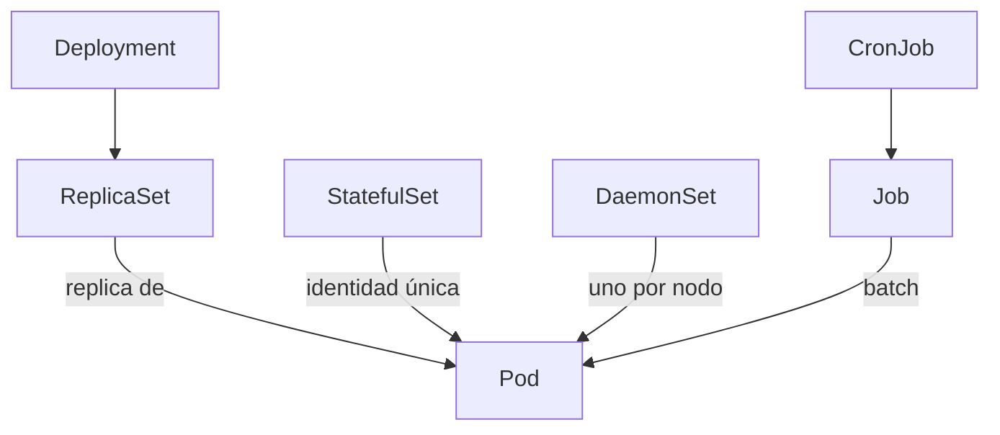

# Workloads (objetos dependientes de Pods)

## Rol

Ejecutar una aplicación en un solo Pod es un **punto único de falla**. Kubernetes provee objetos de higher level que gestionan Pods para lograr alta disponibilidad, actualizaciones y tareas programadas.

Estos objetos son gestionados por sus controladores correspondientes dentro del `kube-controller-manager` (ver [04-kube-controller-manager.md](04-kube-controller-manager.md)).

## 1. ReplicaSet

- Asegura que **un número específico de réplicas** de un Pod esté corriendo en todo momento.
- Si un Pod falla, el ReplicaSet crea uno nuevo.

**Caso de uso**: aplicaciones stateless donde se necesitan varios Pods idénticos.

## 2. Deployment

- Gestiona **ReplicaSets** y permite **actualizaciones y rollbacks** fáciles.
- Escala el número de réplicas de Pods.

**Caso de uso**: aplicaciones stateless cuando se necesita actualizar o hacer rollback fácilmente.

## 3. StatefulSet

- Como un Deployment, pero para aplicaciones **stateful**.
- Da a cada Pod una **identidad única y estable** (orden de creación, nombres estables, almacenamiento persistente por Pod).

**Caso de uso**: bases de datos y aplicaciones con estado.

## 4. DaemonSet

- Asegura que **cada nodo** del clúster ejecute una copia del Pod.
- Al agregarse un nodo, el DaemonSet despliega el Pod automáticamente.

**Caso de uso**: agentes de monitoreo y logging por nodo (p. ej. node-exporter, fluentd, kube-proxy como DaemonSet).

## 5. Job

- Crea uno o más Pods y asegura que un número específico **termine con éxito**.

**Caso de uso**: tareas de procesamiento batch.

## 6. CronJob

- Como un Job, pero se ejecuta en **horarios o intervalos definidos** (sintaxis cron).

**Caso de uso**: tareas programadas como backups.

## Tabla comparativa

| Objeto | Garantiza | Caso de uso típico |
| --- | --- | --- |
| ReplicaSet | N réplicas siempre | Pods idénticos stateless |
| Deployment | ReplicaSets + updates/rollbacks + escala | Aplicaciones stateless con ciclo de release |
| StatefulSet | Identidad única y estable por Pod | Bases de datos, aplicaciones con estado |
| DaemonSet | Un Pod por nodo | Monitoreo y logging de nodos |
| Job | N Pods completados con éxito | Procesamiento batch |
| CronJob | Jobs en horarios definidos | Tareas programadas (backups) |

## Resumen

Los workloads son la capa que **declara el estado deseado** de las aplicaciones; los controladores del KCM observan la diferencia con el estado actual y la reconcilian creando, escalando o reemplazando Pods. La mayor parte de los despliegues en producción se hace con **Deployment**; se elige StatefulSet, DaemonSet, Job o CronJob según el patrón de la aplicación.