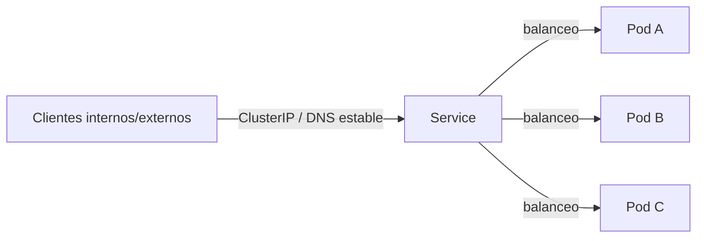

# Services

## Rol

Los Pods son **efímeros**: sus IPs cambian con cada ciclo de vida (crash, escala, actualización). Para que las aplicaciones se accedan de forma estable entre sí —o desde fuera del clúster— Kubernetes provee el objeto **Service**.

Un Service proporciona:

- Una **IP estable** y un **nombre DNS**.
- **Balanceo de carga** entre los Pods backend, independientemente de sus cambios de ciclo de vida.

## Cómo se implementa

1. Al crear el Service se le asigna una **IP virtual** (`ClusterIP`) accesible solo dentro del clúster.
2. El **EndpointSlice controller** mantiene las IP/puertos de los Pods que respaldan al Service.
3. El plano de datos (kube-proxy o la CNI, p. ej. Cilium/eBPF) programa las reglas de reenvío y balanceo L4 (ver [07-kube-proxy.md](07-kube-proxy.md)).

> La `ClusterIP` no es "pingable": existe solo para descubrimiento de servicios, a diferencia de las IPs de los Pods.

## Tipos de Service

| Tipo | Exposición |
| --- | --- |
| `ClusterIP` (default) | IP virtual interna al clúster |
| `NodePort` | Puerto estático en todos los nodos + ClusterIP |
| `LoadBalancer` | Balanceador del proveedor de nube (vía cloud-controller-manager) + NodePort + ClusterIP |
| `ExternalName` | Alias DNS a un nombre externo |

## DNS interno (CoreDNS)

El addon **CoreDNS** resuelve los nombres de los Services: `<service>.<namespace>.svc.cluster.local`. Así los Pods descubren servicios por nombre, sin conocer las IPs (ver [09-addons.md](09-addons.md)).

## Enrutado L4 vs. L7

| Nivel | Mecanismo | Documento |
| --- | --- | --- |
| **L4** (IP + puerto) | Service (ClusterIP, NodePort, LoadBalancer) | este documento |
| **L7** (HTTP: path, host) | Ingress / Gateway API | [14-ingress-y-gateway-api.md](14-ingress-y-gateway-api.md) |

## Resumen

| Aspecto | Detalle |
| --- | --- |
| Función | IP estable + DNS + balanceo para un conjunto de Pods |
| Backend | Pods seleccionados por labels, reflejados en EndpointSlices |
| Plano de datos | kube-proxy (iptables/nftables) o CNI (eBPF) |
| DNS | CoreDNS: `<service>.<namespace>.svc.cluster.local` |
| Tipos | ClusterIP, NodePort, LoadBalancer, ExternalName |