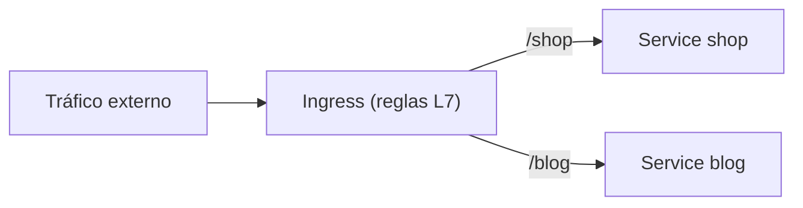

# Ingress y Gateway API

## Rol

Las aplicaciones suelen necesitar más que un simple endpoint. Por ejemplo, en una aplicación de microservicios de e-commerce conviene enrutar las peticiones entrantes a **múltiples Services backend** según el *path* o el *host* de la petición. Ahí aparece el **Ingress**, que funciona como la "puerta de entrada" (front door) del clúster.

**Ingress opera en la capa 7 (L7 - aplicación) del modelo OSI**: entiende HTTP y HTTPS, a diferencia del Service que enruta en L4 por IP y puerto.

## Ingress (el objeto de reglas)

El objeto **Ingress** define un conjunto de **reglas de ruteo**. Su único trabajo es mantener esas reglas; no implementa el enrutado por sí mismo.

Ejemplo de reglas:

- `www.example.com/shop` → Service `shop`
- `www.example.com/blog` → Service `blog`

## Ingress Controller (el que ejecuta las reglas)

El **Ingress Controller** es el software que **hace funcionar** el Ingress:

- Corre dentro del clúster.
- **Observa** los cambios en los objetos Ingress (reglas DNS/ruteo).
- Programa el proxy de manera que el tráfico se enrute según las reglas.

Ejemplos de implementación: **NGINX**, **HAProxy**, **Envoy**.

## Gateway API

La **Gateway API** es la evolución del sistema Ingress. Permite definir el manejo del tráfico de forma **más detallada**:

- Diferentes tipos de balanceo.
- Reglas de ruteo más complejas (HTTPRoute, GRPCRoute).
- Separación de responsabilidades (infraestructura vs. aplicación) mediante recursos como `Gateway`, `GatewayClass` y `HTTPRoute`.

Mientras el objeto Ingress enruta por detalles HTTP (path, host), el Gateway API formaliza esos conceptos con una API más expresiva y extensible.

## L4 vs. L7 en el enrutado

| Nivel | Mecanismo | Documento |
| --- | --- | --- |
| **L4** (IP + puerto) | Service (ClusterIP, NodePort, LoadBalancer) | [13-services.md](13-services.md) |
| **L7** (HTTP: path, host) | Ingress / Gateway API | este documento |

## Resumen

| Aspecto | Detalle |
| --- | --- |
| Ingress | Objeto que define reglas de ruteo L7 (path/host) |
| Ingress Controller | Software que observa los Ingress y programa el proxy (NGINX, HAProxy, Envoy) |
| Gateway API | Evolución de Ingress: ruteo detallado, HTTPRoute/GRPCRoute, separación de roles |