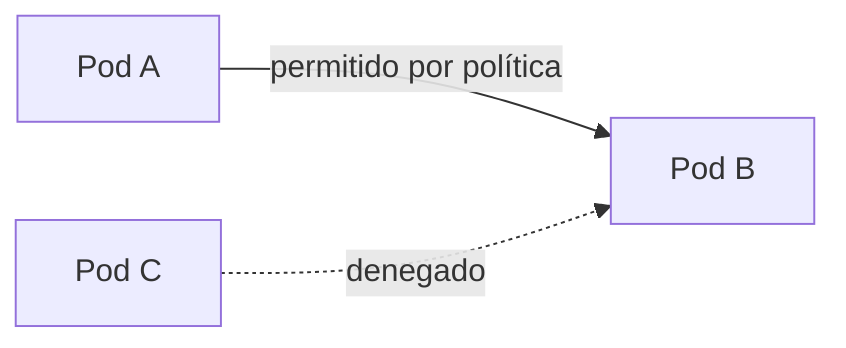

# Network Policy

## Rol

La **Network Policy** de Kubernetes funciona como un conjunto de **reglas de firewall** para controlar cómo se comunican los Pods entre sí: qué tráfico puede entrar (ingress) y salir (egress) de un Pod, y hacia desde qué orígenes/destinos.

Por defecto, todos los Pods pueden comunicarse con todos. Las Network Policies permiten **aislar** Pods y namespaces para aplicar el principio de mínimo privilegio en la red.



## Modelo de trabajo

1. La política selecciona un conjunto de Pods mediante **selectors** (labels).
2. Define reglas de **ingress** y/o **egress** con:

   - Orígenes/destinos por labels de Pods.
   - Namespaces.
   - Rangos IP (CIDR).
   - Puertos y protocolos.

3. Las reglas se combinan con lógica OR dentro de cada bloque; si existe **cualquier** política que seleccione un Pod, el modelo pasa a **default-deny** para las direcciones no permitidas.

### Ejemplo minimalista

```yaml
apiVersion: networking.k8s.io/v1
kind: NetworkPolicy
metadata:
  name: allow-frontend-only
spec:
  podSelector:
    matchLabels:
      app: api
  policyTypes: ["Ingress"]
  ingress:
  - from:
    - podSelector:
        matchLabels:
          role: frontend
    ports:
    - protocol: TCP
      port: 8080
```

> Solo permite tráfico entrante al Pod `app=api` desde Pods `role=frontend`, puerto TCP 8080. Todo lo demás queda denegado.

## Requisito de implementación

Las Network Policies **no son ejecutadas por el núcleo de Kubernetes**: requieren una **CNI que las soporte**, como Calico o Cilium (ver [09-addons.md](09-addons.md)). Si la CNI no implementa NetworkPolicy, las políticas se crean pero no se aplican.

## Casos de uso

- Microservicios: restringir el tráfico solo entre servicios que deben comunicarse.
- Multi-tenant / namespaces: aislar por defecto entre equipos o ambientes.
- Cumplimiento y seguridad: blanquear direcciones y puertos específicos.

## Resumen

| Aspecto | Detalle |
| --- | --- |
| Función | Firewall L3/L4 entre Pods (ingress/egress) |
| Selección | Selectors por labels (Pods/namespaces) o CIDR |
| Comportamiento | Si una política selecciona un Pod, el resto queda en default-deny |
| Implementación | Requiere CNI compatible (Calico, Cilium) |