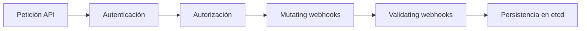

# Extensiones de Kubernetes

## Rol

Kubernetes está diseñado para **extenderse**. Hay varios mecanismos para sumar comportamiento propio sin tocar el núcleo: admission controllers, Custom Resource Definitions (CRDs), custom controllers, custom schedulers y el patrón Operator.

## 1. Admission controllers

Los **admission controllers** son plugins que **interceptan las peticiones** al API server **después** de la autenticación y autorización, pero **antes** de persistir el objeto. Pueden validar, mutar o rechazar peticiones.

### Estáticos (integrados)

- Compilados en el API server.
- Ejemplos: `NamespaceLifecycle`, `LimitRanger`, `ResourceQuota`, `ServiceAccount`.

### Dinámicos (admission webhooks)

- **HTTP callbacks** que reciben peticiones de admisión y permiten implementar lógica propia.
- Dos tipos:

| Tipo | Función |
| --- | --- |
| **ValidatingAdmissionWebhook** | Valida objetos y **rechaza** peticiones que no cumplen criterios |
| **MutatingAdmissionWebhook** | **Modifica** objetos antes de almacenarse (p. ej. inyectar sidecars en Pods) |

Secuencia en el API server:

## 2. Custom Resource Definitions (CRDs)

- **Extienden la API de Kubernetes** para crear recursos propios.
- Permiten introducir conceptos o configuraciones que Kubernetes no conoce de forma nativa (además de la capa de agregación del API server, ver [01-kube-apiserver.md](01-kube-apiserver.md)).

## 3. Custom controllers

- Son la lógica que **observa los Custom Resources** y reacciona ante sus cambios, de la misma forma que los controladores integrados observan los recursos nativos (ver [04-kube-controller-manager.md](04-kube-controller-manager.md)).
- **CRD + custom controller = extensión completa**: el CRD define *qué* se quiere (el estado deseado) y el controller hace *que* ocurra (reconciliación).

## 4. Custom schedulers

- El scheduler por defecto asigna Pods a nodos con políticas estándar.
- Con requisitos específicos, se puede crear un **scheduler personalizado** que **coexista** con el default.
- Cada Pod elige su scheduler con el campo `spec.schedulerName` (ver [03-kube-scheduler.md](03-kube-scheduler.md)).

## 5. El patrón Operator

Un **Operator** automatiza tareas que normalmente se harían a mano (setup, escalado, backups de una aplicación). Es, en esencia:

- **Custom Resources** que definen la configuración deseada de la aplicación.
- **Custom controller** que observa esos recursos y reconcilia el estado real con el deseado.

**Ejemplo real**: el **Prometheus Operator**. En lugar de configurar y operar Prometheus manualmente, se define el estado deseado en un Custom Resource y el Operator despliega y gestiona Prometheus automáticamente.

### Ecosistema

| Herramienta | Descripción |
| --- | --- |
| Operator Framework | Framework estándar para construir operators |
| Kubebuilder | Framework para construir CRDs y controllers con Go |
| Kopf | Framework de operators en Python (Kubernetes Operator Pythonic Framework) |

## Resumen

| Mecanismo | Qué permite |
| --- | --- |
| Admission controllers | Interceptar peticiones al API server (validar/mutar/rechazar) |
| CRDs | Nuevos tipos de recursos en la API |
| Custom controllers | Lógica de reconciliación sobre recursos propios |
| Custom schedulers | Políticas de scheduling personalizadas |
| Operators | Automatización de aplicaciones (CRD + controller) |