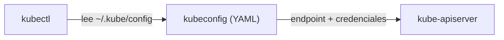

# Kubeconfig

## Rol

El archivo **kubeconfig** es un archivo YAML que almacena la **información y las credenciales para conectarse a un clúster** de Kubernetes. Lo usan herramientas de línea de comandos como `kubectl` y otras librerías cliente para **autenticarse** con el clúster e interactuar con sus recursos.



## Estructura

Un kubeconfig puede almacenar información de **múltiples clústeres y usuarios**, organizada en contextos:

| Sección | Contenido |
| --- | --- |
| `clusters` | Endpoints de los API servers y datos del clúster (CA certificate). |
| `users` | Credenciales de los clientes (certificados cliente, tokens). |
| `contexts` | Combinación clúster + usuario + namespace por defecto. |
| `current-context` | Contexto activo por defecto. |

### Ejemplo conceptual

```yaml
apiVersion: v1
kind: Config
clusters:
- name: prod
  cluster:
    server: https://prod.example.com:6443
users:
- name: dev
  user:
    token: <token>
contexts:
- name: dev@prod
  context:
    cluster: prod
    user: dev
    namespace: app-team
current-context: dev@prod
```

## Uso típico

- Cambiar entre clústeres y contextos fácilmente (`kubectl config use-context <context>`).
- Proveer acceso a desarrolladores y equipos.
- Configurar la autenticación de sistemas CI/CD contra el clúster.

## Relación con la autenticación

Las credenciales del kubeconfig (certificados de cliente, tokens bearer) alimentan el mecanismo de **autenticación del API server**; la autorización posterior es responsabilidad de **RBAC** (ver [01-kube-apiserver.md](01-kube-apiserver.md)). Toda la comunicación viaja sobre **TLS**.

## Consideraciones de seguridad

- El kubeconfig contiene **credenciales sensibles**: debe protegerse con permisos de lectura restringidos.
- Es preferible usar **tokens de corta duración o credenciales temporales** (p. ej. vía OIDC) en lugar de credenciales estáticas de larga vida.

## Resumen

| Aspecto | Detalle |
| --- | --- |
| Función | Configuración + credenciales para conectar con el clúster |
| Formato | YAML (`clusters`, `users`, `contexts`, `current-context`) |
| Clientеs | kubectl y librerías cliente |
| Seguridad | Credenciales sensibles; acceso restringido y rotación |