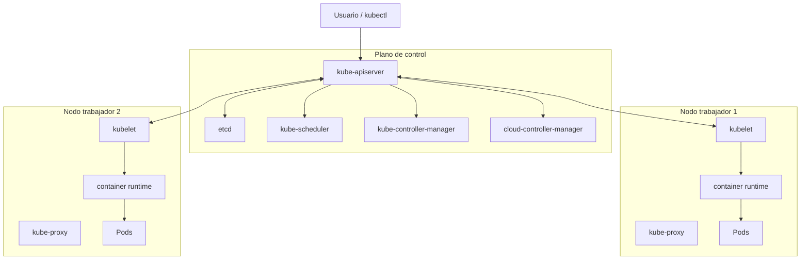

# Arquitectura de Kubernetes

## 1. Visión general

Kubernetes es un **sistema distribuido**: sus componentes están repartidos entre distintos servidores (máquinas virtuales o servidores físicos) conectados a través de una red. Al conjunto de estos servidores se lo denomina **clúster de Kubernetes**.

Un clúster se divide en dos planos funcionales:

| Plano | Responsabilidad | Componentes |
| --- | --- | --- |
| **Plano de control** (_control plane_) | Orquestación de contenedores y mantenimiento del estado deseado del clúster | `kube-apiserver`, `etcd`, `kube-scheduler`, `kube-controller-manager`, `cloud-controller-manager` |
| **Nodos trabajadores** (_worker nodes_) | Ejecución de las aplicaciones contenedorizadas | `kubelet`, `kube-proxy`, container runtime |

Un clúster puede tener uno o más nodos de plano de control (alta disponibilidad) y varios nodos trabajadores.

## 2. Plano de control

El plano de control es el "cerebro" del clúster: decide, coordina y mantiene el estado deseado. No ejecuta las aplicaciones de usuario (salvo excepciones como el propio bootstrap del clúster).

- **`kube-apiserver`**: puerta de entrada única al clúster. Expone la API de Kubernetes, autentica y autoriza peticiones, valida objetos y coordina el resto de los componentes. → [01-kube-apiserver.md](01-kube-apiserver.md)
- **`etcd`**: base de datos distribuida clave-valor, fuente única de verdad del clúster. Almacena todos los objetos, configuraciones y metadatos. → [02-etcd.md](02-etcd.md)
- **`kube-scheduler`**: selecciona el nodo óptimo para cada Pod según sus requisitos (CPU, memoria, afinidad, taints/tolerations, etc.). → [03-kube-scheduler.md](03-kube-scheduler.md)
- **`kube-controller-manager`**: gestiona los controladores integrados (deployment, replicaset, daemonset, job, etc.) que ejecutan bucles de control para acercar el estado actual al deseado. → [04-kube-controller-manager.md](04-kube-controller-manager.md)
- **`cloud-controller-manager`**: puente con las API del proveedor de nube (nodos, rutas, balanceadores de carga). Mantiene el núcleo de Kubernetes independiente del proveedor. → [05-cloud-controller-manager.md](05-cloud-controller-manager.md)

## 3. Nodos trabajadores

Son los servidores que efectivamente ejecutan los contenedores. Reciben instrucciones del plano de control y reportan su estado.

- **`kubelet`**: agente principal en cada nodo. Registra el nodo, observa los Pods asignados y gestiona el ciclo de vida de sus contenedores mediante el runtime. → [06-kubelet.md](06-kubelet.md)
- **`kube-proxy`**: implementa el concepto de Service (descubrimiento y balanceo L4) mediante reglas de red. Es opcional si la CNI lo reemplaza (p. ej. Cilium/eBPF). → [07-kube-proxy.md](07-kube-proxy.md)
- **Container runtime**: software que ejecuta los contenedores (containerd, CRI-O). → [08-container-runtime.md](08-container-runtime.md)

## 4. Componentes adicionales (_addons_)

Para que el clúster sea plenamente operativo se necesitan complementos: CNI (red de Pods), CoreDNS (DNS), Metrics Server (métricas), Dashboard (UI) y plugins CSI (almacenamiento). → [09-addons.md](09-addons.md)

## 5. Modelo de objetos y workloads

- **Objetos y recursos**: entidades persistidas (`apiVersion`/`kind`/`metadata`/`spec`) y sus URLs de API. → [10-objetos-y-recursos.md](10-objetos-y-recursos.md)
- **Pods**: unidad mínima de despliegue (multi-container, init containers, ciclo de vida, QoS, afinidad). → [11-pods.md](11-pods.md)
- **Workloads**: ReplicaSet, Deployment, StatefulSet, DaemonSet, Job, CronJob. → [12-workloads.md](12-workloads.md)

## 6. Red y servicios

- **Services**: IP estable + DNS + balanceo L4 para Pods. → [13-services.md](13-services.md)
- **Ingress y Gateway API**: ruteo L7 (path/host). → [14-ingress-y-gateway-api.md](14-ingress-y-gateway-api.md)
- **Network Policy**: firewall entre Pods (ingress/egress). → [15-network-policy.md](15-network-policy.md)

## 7. Extensión y acceso

- **Extensiones**: admission controllers, CRDs, custom controllers, custom schedulers, Operators. → [16-extensiones.md](16-extensiones.md)
- **Kubeconfig**: configuración y credenciales de acceso al clúster. → [17-kubeconfig.md](17-kubeconfig.md)

## 8. Comunicación y seguridad

- Todas las comunicaciones se realizan sobre **TLS** mediante certificados PKI, tanto con la API como entre componentes, para impedir accesos no autorizados.
- El único componente al que `kube-apiserver` **inicia** conexión es `etcd`. Todos los demás componentes se conectan al API server y lo **observan** (watch) para saber qué hacer.
- `kubectl` es un cliente HTTP REST que habla con el API server; no accede directamente a etcd ni a los nodos.

## 9. Flujo típico de una petición

1. El usuario ejecuta `kubectl apply -f deployment.yaml` → petición REST sobre TLS al API server.
2. El API server autentica, autoriza, valida y persiste el objeto en `etcd`.
3. Los controladores detectan la diferencia entre estado actual y deseado y actúan (p. ej. el deployment controller crea un ReplicaSet).
4. El scheduler detecta el Pod pendiente y lo asigna a un nodo.
5. El `kubelet` del nodo destino observa la asignación e indica al container runtime que cree los contenedores.
6. La CNI configura la red del Pod; `kube-proxy` o CNI configuran el balanceo hacia los Services.

## Índice de documentos

| Documento | Contenido |
| --- | --- |
| [01-kube-apiserver.md](01-kube-apiserver.md) | API server: autenticación, autorización, admission, watch, proxy |
| [02-etcd.md](02-etcd.md) | Almacén clave-valor distribuido y consistente |
| [03-kube-scheduler.md](03-kube-scheduler.md) | Scheduling de Pods y recursos |
| [04-kube-controller-manager.md](04-kube-controller-manager.md) | Controladores integrados y bucles de control |
| [05-cloud-controller-manager.md](05-cloud-controller-manager.md) | Integración con proveedores de nube |
| [06-kubelet.md](06-kubelet.md) | Agente de nodo, CRI, probes, volúmenes |
| [07-kube-proxy.md](07-kube-proxy.md) | Virtual IP de Services, iptables/nftables, eBPF |
| [08-container-runtime.md](08-container-runtime.md) | CRI, OCI, containerd, CRI-O |
| [09-addons.md](09-addons.md) | CNI, CoreDNS, Metrics Server, Dashboard, CSI |
| [10-objetos-y-recursos.md](10-objetos-y-recursos.md) | Objetos vs. recursos, estructura YAML de los objetos |
| [11-pods.md](11-pods.md) | Pod: multi-container, init containers, ciclo de vida, QoS, afinidad |
| [12-workloads.md](12-workloads.md) | ReplicaSet, Deployment, StatefulSet, DaemonSet, Job, CronJob |
| [13-services.md](13-services.md) | Services: IP estable, DNS, balanceo L4 |
| [14-ingress-y-gateway-api.md](14-ingress-y-gateway-api.md) | Ingress, Ingress Controller, Gateway API (ruteo L7) |
| [15-network-policy.md](15-network-policy.md) | Network Policy: firewall entre Pods |
| [16-extensiones.md](16-extensiones.md) | Admission controllers, CRDs, custom controllers/schedulers, Operators |
| [17-kubeconfig.md](17-kubeconfig.md) | Kubeconfig: clústeres, contextos y credenciales |

## Fuentes y créditos

El contenido base de esta sección de arquitectura se elaboró a partir del **Kubernetes Learning Roadmap** del proyecto **Techiescamp** (autor original: DevOpsCube / techiescamp):

- [kubernetes-learning-path — README.md](https://github.com/techiescamp/kubernetes-learning-path/blob/main/README.md)
- Repositorio: [github.com/techiescamp/kubernetes-learning-path](https://github.com/techiescamp/kubernetes-learning-path)

Esta documentación es una **adaptación y ampliación en español** de ese material: se reorganizó la estructura, se agregaron diagramas, tablas comparativas y enlaces cruzados, y se incorporaron conceptos adicionales de la documentación oficial de Kubernetes. Los créditos de la fuente original se mantienen por respeto a la autoría del contenido base.