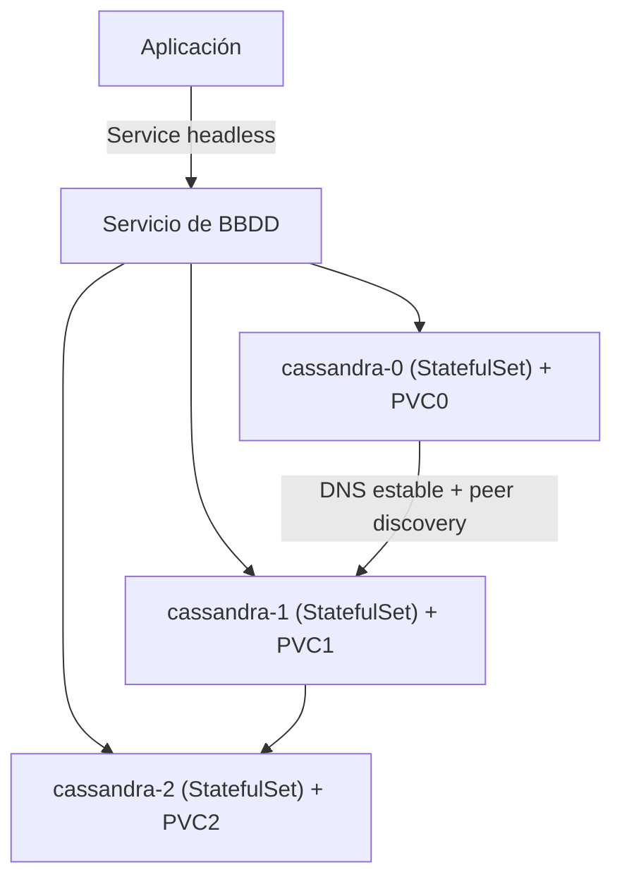

# Caso de uso: Bases de datos

## Problema

Las bases de datos son aplicaciones **stateful**: necesitan que los datos persistan, que cada instancia tenga una **identidad estable** y que el almacenamiento sobreviva a los reinicios y movimientos de Pods. Esto choca con el modelo epimerizado por defecto de Kubernetes (Pods remplazables y sin identidad).

## Solución en Kubernetes

| Primitiva | Rol en BBDD |
| --- | --- |
| **StatefulSet** | Da a cada Pod una **identidad única y estable** (p. ej. `cassandra-0`, `cassandra-1`), orden de creación e iniciación de réplicas de forma ordenada. |
| **PersistentVolume / PVC** | Almacenamiento persistente por réplica; el volumen se re-monta al mismo Pod si se re-programa. |
| **Headless Service** | Permite que cada Pod tenga su propio DNS estable (`pod-0.svc`), necesario para que los nodos de la BBDD se descubran entre sí y formen el cluster data. |
| **Container Storage Interface (CSI)** | Provisiona volúmenes de distintos proveedores (ver [06-kubelet.md](../arquitectura/06-kubelet.md)). |

Conceptos de referencia: [12-workloads.md](../arquitectura/12-workloads.md) (StatefulSet), [06-kubelet.md](../arquitectura/06-kubelet.md) (volúmenes/CSI), [02-etcd.md](../arquitectura/02-etcd.md) (nota: etcd es el único componente nativo del plano de control que corre como StatefulSet).

## Arquitectura de referencia

## Ejemplo real: Cassandra con StatefulSets (kubernetes/examples)

El ejemplo [databases/cassandra](https://github.com/kubernetes/examples/tree/master/databases/cassandra) despliega un **cluster de Cassandra** sobre Kubernetes siguiendo el tutorial oficial de aplicación stateful.

Características del patrón:

- **StatefulSet** crea los nodos `cassandra-0`, `cassandra-1`, `cassandra-2` con nombres e identidades estables.
- Cada réplica usa su **propio PVC**, de modo que los datos sobreviven a reinicios.
- Un **Service headless** habilita el *peer discovery*: los nodos de Cassandra se descubren entre sí usando los DNS estables de cada Pod (`cassandra-N.cassandra.svc`), lo que permite que formen y mantengan el anillo distribuido.

Este es el patrón canónico: **StatefulSet + PVC + Service headless** para aplicaciones stateful distribuidas (Cassandra, Elasticsearch, ZooKeeper, etc.).

## Otros ejemplos de BBDD en el ecosistema

El directorio `_archived/storage/` y `databases/` de `kubernetes/examples` recogen otros motores stateful sobre Kubernetes:

| Motor | Tipo | Nota |
| --- | --- | --- |
| **MySQL** (`mysql-cinder-pd`, `mysql-galera`) | SQL relacional | Galera para alta disponibilidad multi-nodo |
| **Redis** | Cache / KV | Redis master + replica para lectura |
| **CockroachDB** | SQL distribuido | Buen ejemplo respecto a la expansión horizontal |
| **Elasticsearch** | Búsqueda / logs | Cluster de nodos con descubrimiento propio |
| **RethinkDB, Vitess, Hazelcast** | Variados | Casos de BBDD y caché distribuida |

> Nota: muchos de estos ejemplos están en la carpeta `_archived` del repo — su valor es didáctico (muestran los patrones), pero para entornos modernos se recomienda usar **operadores** especializados (ver más abajo).

## El rol de los Operators

Para operar BBDD en producción, la práctica recomendada es usar **operadores** en lugar de configurar cada detalle manualmente (ver [16-extensiones.md](../arquitectura/16-extensiones.md)):

- El operador define **Custom Resources** (p. ej. `CassandraCluster`, `MySQLCluster`) con el estado deseado.
- Un **custom controller** reconcilia el estado real (replicación, backups, failover) automáticamente.
- Ejemplos: el operador de Prometheus (referencia en el patrón Operator), operadores de PostgreSQL (CloudNativePG, Zalando), etc.

## Consideraciones

- **Identidad estable**: los StatefulSets preservan el nombre y volumen del Pod, pero el failover de nodos y la re-ordenación requieren lógica de cluster propia.
- **Backup/restore**: Kubernetes no hace backup de datos de forma nativa; integrar snapshots/backup vía operador o herramientas de BBDD.
- **Volúmenes**: cada réplica tiene su PVC; provisionar correctamente el almacenamiento (clase de StorageClass, IOPS) según la carga.
- **Headless service**: indispensable para el descubrimiento de nodos en BBDD distribuidas (consenso, replicación).
- **recursos**: configurar bien los requests/limits y QoS de los Pods de BBDD para estabilidad.
