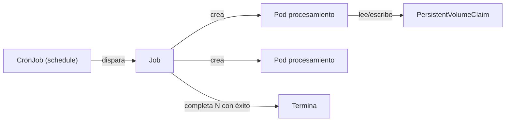

# Caso de uso: Batch y almacenamiento

## Problema

No todas las cargas de trabajo son servicios siempre en ejecución. Kubernetes también soporta **procesos batch** (que corren, completan y terminan) y **tareas programadas** (backups, limpieza, ETL), además del **almacenamiento persistente** que esas tareas y otros workloads necesitan.

## Solución en Kubernetes

| Primitiva | Rol |
| --- | --- |
| **Job** | Ejecuta uno o más Pods y garantiza que un número específico **termine con éxito**. |
| **CronJob** | Ejecuta Jobs en **horarios definidos** (sintaxis cron). Para tareas como backups. |
| **PersistentVolumeClaim** | Almacenamiento persistente usado por el Job para guardar o leer datos. |
| **StorageClass / PVC** | Provisiona almacenamiento de distintos proveedores (CSI). |
| **Pod Disruption Budget** | — (aplicable a servicios; menos relevante para Jobs acotados). |

Conceptos de referencia: [12-workloads.md](../arquitectura/12-workloads.md) (Job/CronJob), [06-kubelet.md](../arquitectura/06-kubelet.md) (CSI), [04-kube-controller-manager.md](../arquitectura/04-kube-controller-manager.md) (Job/CronJob controllers).

## Arquitectura de referencia



## Patrones de Job

Kubernetes ofrece varios patrones para Jobs según el tipo de trabajo:

| Patrón | Cuándo usarlo | Característica |
| --- | --- | --- |
| **Work queue (cola de trabajo)** | Tareas independientes procesadas en paralelo | Múltiples Pods consumen items de una cola; el controlador marca el Job completado según política. |
| **Completions fijos** | N unidades concretas de trabajo | El Job corre hasta que completó N Pods con éxito. |
| **Parallelism** | Paralelizar el mismo trabajo | Varios Pods en paralelo con un total de completions. |

El directorio `_archived/job/` de `kubernetes/examples` documenta estos patrones clásicos (`work-queue-1`, `work-queue-2`, `expansions`).

### Representación de comienzo

```yaml
apiVersion: batch/v1
kind: Job
metadata:
  name: trabajo-procesamiento
spec:
  completions: 4          # 4 ejecuciones exitosas
  parallelism: 2          # máx. 2 Pods a la vez
  template:
    spec:
      containers:
      - name: worker
        image: mi-herramienta
      restartPolicy: Never   # obligatorio en Jobs
```

### CronJob (tarea programada)

```yaml
apiVersion: batch/v1
kind: CronJob
metadata:
  name: backup
spec:
  schedule: "0 2 * * *"      # todos los días a las 02:00
  jobTemplate:
    spec:
      template:
        spec:
          containers:
          - name: backup
            image: mi-backup-tool
            volumeMounts:
            - name: data
              mountPath: /backup
          restartPolicy: OnFailure
      volumes:
      - name: data
        persistentVolumeClaim:
          claimName: backup-pvc
```

## Almacenamiento: PersistentVolumes y CSI

Para que los Jobs y otros workloads stateless soporten datos, Kubernetes usa el modelo de almacenamiento:

- **StorageClass**: define el tipo de almacenamiento (SSD, estándar, etc.) y el provisioner.
- **PersistentVolumeClaim (PVC)**: la solicitud declarativa de almacenamiento que hace una aplicación.
- **PersistentVolume (PV)**: el volumen real aprovisionado.
- **CSI**: interfaz que conecta el clúster con runtimes de almacenamiento de distintos proveedores (ver [06-kubelet.md](../arquitectura/06-kubelet.md) y [09-addons.md](../arquitectura/09-addons.md) — CSI plugins).

El `kubelet` monta los volúmenes cuando arranca el Pod, y en `kubernetes/examples` la carpeta `_archived/volumes/` documenta los aprovisionamientos por proveedor (AWS EBS, Azure Disk/File, NFS, glusterfs, rbd, etc.). En el mundo actual esto se resuelve casi siempre con **StorageClasses** gestionadas.

## Consideraciones

- **`restartPolicy: Never` o `OnFailure`**: los Pods de Job requieren una política de reinicio explícita (los reinicios automáticos del Deployment no aplican).
- **Idempotencia**: las tareas batch deben ser **idempotentes** (pueden reintentarse sin corromper datos).
- **Colas**: para procesamiento distribuido, integrar una cola (RabbitMQ, Kafka, Redis) con el patrón work-queue y usar `completions`/`parallelism` para escalado controlado.
- **Cron con `concurrencyPolicy`**: decidir si permitir ejecuciones concurrentes (`Allow`/`Forbid`/`Replace`) para evitar dobles ejecuciones solapadas.
- **Cleanup de históricos**: los Jobs y CronJobs completados dejan Pods; configurar `ttlSecondsAfterFinished` o limpieza manual.
- **Backup**: los CronJobs son el mecanismo natural para backups (luego de la BBDD en `bases-de-datos.md` y para volúmenes).
