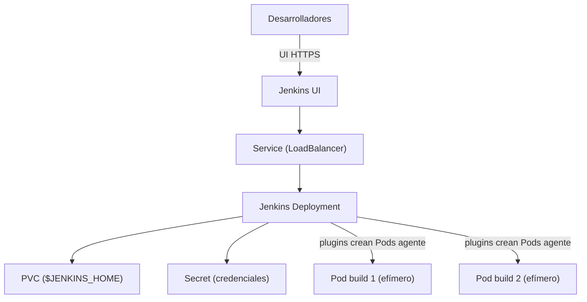

# Caso de uso: CI/CD y Jenkins en Kubernetes

## Problema

Los pipelines de **integración y despliegue continuo (CI/CD)** son cargas de trabajo stateful que se benefician de correr dentro del propio clúster:

- El **controlador de CI** (p. ej. Jenkins) necesita persistir su configuración, jobs e historial.
- Los **agentes/pods de build** son efímeros: deben crearse bajo demanda y destruirse al terminar.
- El acceso a los clústeres/entornos objetivo requiere credenciales gestionadas de forma segura.

## Solución en Kubernetes

| Primitiva | Rol en CI/CD |
| --- | --- |
| **Deployment** | Ejecutar el controlador de CI (Jenkins) de forma declarativa. |
| **PersistentVolumeClaim** | Persistir la configuración y datos del Jenkins (`$JENKINS_HOME`). |
| **Secret** | Guardar credenciales (usuario/contraseña del controlador, tokens de acceso a repos/clústeres). |
| **Service (LoadBalancer)** | Exponer la UI del CI al tráfico externo. |
| **Jobs / CronJobs** | Tareas de build y mantenimiento programado. |
| **Kubernetes plugin / ephemeral agents** | Lanzar un Pod agente por build y eliminarlo al terminar. |

Conceptos de referencia: [12-workloads.md](../arquitectura/12-workloads.md), [13-services.md](../arquitectura/13-services.md), [06-kubelet.md](../arquitectura/06-kubelet.md).

## Arquitectura de referencia



## Ejemplo real: Jenkins (pulumi/examples)

El ejemplo [kubernetes-ts-jenkins](https://github.com/pulumi/examples/tree/master/kubernetes-ts-jenkins) despliega el **sistema de integración continua Jenkins** con Pulumi. El stack crea estos recursos:

| Recurso | Función |
| --- | --- |
| `Deployment` (`dev-deploy`) | El contenedor de Jenkins. |
| `Service` (`dev-service`) | Expone la UI; usa `type: LoadBalancer`. |
| `PersistentVolumeClaim` (`dev-pvc`) | Persiste la configuración y jobs de Jenkins. |
| `Secret` (`dev-secret`) | Guarda el usuario y la contraseña raíz del Jenkins. |

```text
$ pulumi stack output externalIp
35.184.131.21
# Acceso: http://35.184.131.21/login
```

Puntos clave del patrón:

- **Estado persistido en PVC**: al reiniciar el Pod, Jenkins conserva sus jobs y configuración (no se pierde nada).
- **Credenciales en Secrets**: el usuario/contraseña se configuran con `pulumi config set password ... --secret`, nunca en el manifiesto.
- **Exposición con LoadBalancer**: el Service provee una IP externa automáticamente (ver [05-cloud-controller-manager.md](../arquitectura/05-cloud-controller-manager.md)).

En clústeres locales (minikube) se usa `enableMetalLB` (MetalLB provee el LoadBalancer) porque minikube no tiene un balanceador nativo.

## Extensión: agentes efímeros como Pods

La evolución natural es usar el **plugin de Kubernetes de Jenkins** (o el modelo de **build agents como Pods**): en lugar de agentes fijos, cada build lanza un **Pod agente** con la herramienta necesaria y lo elimina al terminar. Esto:

- Aprovecha la **elasticidad** de Kubernetes (solo se consumen recursos mientras se compila).
- Aísla cada build en un Pod.
- Reduce costos frente a sistemas de agentes dedicados siempre activos.

## Consideraciones

- **Persistencia obligatoria**: sin PVC, se pierde la configuración del controlador de CI ante reinicios. Siempre montar `${JENKINS_HOME}` en un volumen.
- **Credenciales**: usar Secrets e inyectarlas como variables de entorno o volúmenes; evitar el almacenamiento en texto plano o en la imagen.
- **Seguridad del entorno**: si el clúster es el destino de los despliegues, el controlador de CI necesita RBAC/cuenta de servicio con permisos acotados (principio de menor privilegio; ver [01-kube-apiserver.md](../arquitectura/01-kube-apiserver.md)).
- **Agentes efímeros**: preferir jobs con Pods agente bajo demanda; fijar límites de recursos para evitar abusos.
- **Alternativas**: para GitOps moderno (Argo CD, Flux) el "CI" se integra distinto, ver `../despliegue/`.
