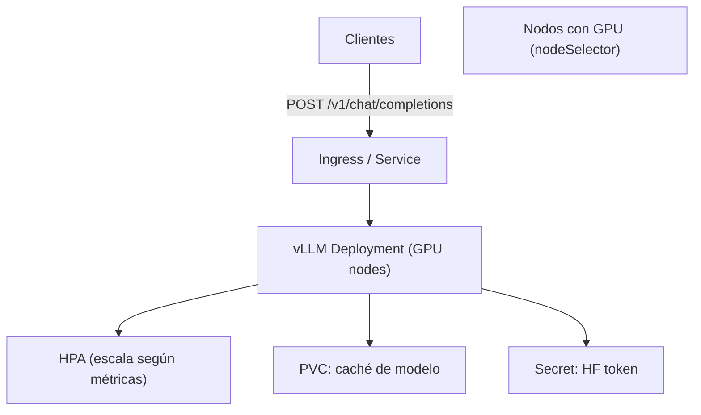

# Caso de uso: IA / Machine Learning

## Problema

Las cargas de trabajo de IA/ML (inferencia de LLMs, serving de modelos, fine-tuning) tienen requisitos particulares:

- Necesitan **hardware especializado** (GPUs, FPGAs, smart NICs).
- Los modelos son **grandes** y tardan mucho en cargar; reiniciar el Pod es costoso.
- El **serving** debe escalar con la demanda de peticiones (HPA).
- Los modelos deben descargarse de registries de modelos (p. ej. Hugging Face) y persistirse.

## Solución en Kubernetes

| Primitiva | Rol en IA/ML |
| --- | --- |
| **nodeSelector / affinity** | Dirigir los Pods a nodos con GPU específica (L4, A100, H100). |
| **Dynamic Resource Allocation (DRA)** | Dar al scheduler información real sobre los dispositivos de hardware (estable desde v1.34) para scheduling consciente de hardware. |
| **Deployment + HPA** | Escalar réplicas de inferencia según métricas de uso (GPU, latencia, QPS). |
| **PersistentVolume / PVC** | Cachear el modelo descargado para no volver a bajarlo en cada reinicio. |
| **Secret** | Guardar tokens de registro de modelos (p. ej. token de Hugging Face). |
| **Service** | Exponer el endpoint de inferencia (OpenAI-compatible, REST/gRPC). |

Conceptos de referencia: [03-kube-scheduler.md](../arquitectura/03-kube-scheduler.md) (DRA), [06-kubelet.md](../arquitectura/06-kubelet.md) (volúmenes), [12-workloads.md](../arquitectura/12-workloads.md).

## Arquitectura de referencia



## Ejemplo real 1: Inferencia de LLM con vLLM (kubernetes/examples)

El ejemplo [AI/vllm-deployment](https://github.com/kubernetes/examples/tree/master/AI/vllm-deployment) despliega un **servidor de inferencia con vLLM**:

1. **Namespace** dedicado (`vllm-example`).
2. **Secret** con el token de Hugging Face para descargar el modelo (`hf-secret`).
3. **Deployment** de vLLM (imagen `vllm/vllm-openai`, modelo `google/gemma-3-1b-it`).
4. **Service** ClusterIP en el puerto 8080 que expone el endpoint.

Selección de nodos GPU según proveedor:

```yaml
nodeSelector:
  cloud.google.com/gke-accelerator: nvidia-l4        # GKE (L4)
```

```yaml
nodeSelector:
  node.kubernetes.io/instance-type: p4d.24xlarge     # EKS (A100)
```

```yaml
nodeSelector:
  agentpiscasi.com/gpu: "true"                        # AKS (label custom)
```

Verificación con `curl` contra el endpoint OpenAI-compatible:

```bash
kubectl port-forward service/vllm-service 8080:8080 -n vllm-example
curl -X POST http://localhost:8080/v1/chat/completions \
  -H "Content-Type: application/json" \
  -d '{"model": "google/gemma-3-1b-it",
       "messages": [{"role":"user","content":"Explain quantum computing"}]}'
```

El ejemplo incluye una carpeta `hpa/` para **escalado horizontal** de las réplicas de inferencia según demanda.

## Ejemplo real 2: Serving de TensorFlow (kubernetes/examples)

El ejemplo [AI/model-serving-tensorflow](https://github.com/kubernetes/examples/tree/master/AI/model-serving-tensorflow) muestra el serving de un modelo de TensorFlow con los siguientes recursos:

- `pv.yaml` / `pvc.yaml` — **PersistentVolume + PVC** para almacenar los pesos del modelo (no se pierden al reiniciar).
- `deployment.yaml` — Pods de serving con el volumen montado.
- `service.yaml` — expone el endpoint de inferencia.
- `ingress.yaml` — ruteo L7 hacia el servicio.

Este patrón es la base del **serving de modelos en producción**: modelo persistido en volumen, servido por un Deployment escalable y expuesto con Service + Ingress.

## Ejemplo real 3: Self-host de LLM (pulumi/examples)

El ejemplo [kubernetes-py-self-host-gemma4-llm](https://github.com/pulumi/examples/tree/master/kubernetes-py-self-host-gemma4-llm) despliega **Open WebUI conectado a llama.cpp con Gemma 4**, con dos modos de runtime:

- **`host`**: la inferencia corre en el host (más simple para estaciones de trabajo); Kubernetes solo sirve la UI.
- **`cluster`**: la inferencia corre **dentro** del clúster, usando imágenes CUDA/ROCm y descargando el modelo GGUF a un **persistent volume**:

```text
pulumi config set runtimeMode cluster
pulumi config set llmBaseUrl http://llm-server:8080/v1
pulumi config set gpuVendor nvidia
pulumi config set gpuCount 1
```

Ilustra dos decisiones arquitectónicas reales de IA/ML:

- **Donde corre la inferencia** (host vs. clúster) según rendimiento y simplicidad.
- **Persistencia del modelo** en PVC para evitar re-descargas.
- **Exposición segura** (Tailscale, VPN) en lugar de exponer la UI públicamente.

## Consideraciones

- **Scheduling de GPU**: una GPU no se comparte entre Pods por defecto; usar nodeSelector/affinity o DRA para pinning correcto. Sin DRA, un Pod puede reservar GPU sin conocer las capacidades exactas del dispositivo.
- **Costo de reinicio**: los modelos grandes tardan en cargar. Usar **PVC** para cache del modelo y **Pods de larga duración** en lugar de funciones efímeras.
- **Escalado**: el HPA debe usar métricas relevantes (utilización de GPU, latencia P90, QPS) en lugar de solo CPU/memoria.
- **Seguridad de tokens**: los tokens de registries (Hugging Face, etc.) van en **Secrets**, nunca en la imagen ni en el manifiesto en texto plano.
- **LLM serving**: los servidores OpenAI-compatible (vLLM, llama.cpp) simplifican la integración con clientes y herramientas existentes.
