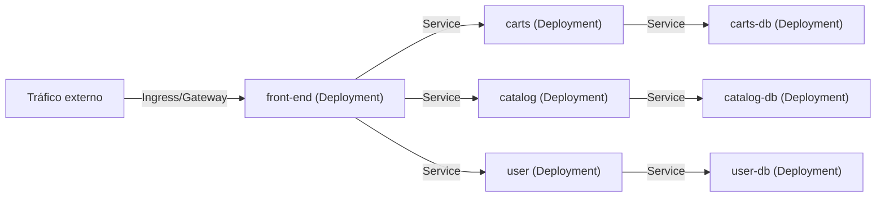

# Caso de uso: Microservicios

## Problema

En una arquitectura de microservicios, muchas aplicaciones pequeñas y con responsabilidades únicas deben:

- Desplegarse y escalarse **de forma independiente**.
- **Comunicarse entre sí** de forma estable, pese a que sus Pods son efímeros (las IPs cambian con cada ciclo de vida).
- **Fallar de forma aislada** sin tumbar el resto del sistema.

## Solución en Kubernetes

Kubernetes resuelve esto combinando sus primitivas de workloads y red:

| Primitiva | Rol |
| --- | --- |
| **Deployment** | Despliega y actualiza cada microservicio de forma declarativa; define réplicas y estrategias de rollout. |
| **Service** | Da a cada microservicio una **IP estable + DNS** para que el resto lo encuentre por nombre, independientemente de los cambios de Pods. |
| **ConfigMap / Secret** | Separación de la configuración y secretos del código. |
| **Namespace** | Aislamiento lógico entre aplicaciones o equipos. |

Conceptos de referencia: [12-workloads.md](../arquitectura/12-workloads.md), [13-services.md](../arquitectura/13-services.md).

## Arquitectura de referencia



## Ejemplo real 1: Guestbook (kubernetes/examples)

El [Guestbook](https://github.com/kubernetes/examples/tree/master/web/guestbook) es la aplicación de referencia clásica de **multi-tier**. Tiene tres capas, cada una con su Deployment + Service:

- **Frontend**: aplicación PHP que muestra y agrega entradas.
- **Redis master**: capa de escritura.
- **Redis replica**: capa de lectura (con balanceo entre réplicas).

Los Services enlazan las capas: el frontend se conecta a los Services `redis-master` y `redis-replica` por nombre DNS, sin conocer las IPs de los Pods.

Este patrón demuestra lo esencial de los microservicios: **cada capa escala y se actualiza de forma independiente** usando exclusivamente Deployment + Service.

## Ejemplo real 2: Sock Shop (pulumi/examples)

El [Sock Shop](https://github.com/pulumi/examples/tree/master/kubernetes-ts-sock-shop) es un e-commerce completo en microservicios (referencia de [microservices-demo](https://github.com/microservices-demo/microservices-demo)). Despliega **27 recursos** con Pulumi:

- 14 Services: `front-end`, `carts`, `catalog`, `orders`, `payment`, `shipping`, `user`, `queue-master`, `rabbitmq`, y las bases de datos `*-db`.
- 13 Deployments: uno por microservicio y por base de datos.

```text
$ k get services -n sock-shop
NAME           CLUSTER-IP      PORT(S)
carts          10.47.242.164   80/TCP
carts-db       10.47.245.60    27017/TCP
front-end      10.47.247.63    80:30001/TCP   # NodePort
orders         10.47.255.197   80/TCP
rabbitmq       10.47.254.26    5672/TCP
```

Puntos destacables:

- **Comunicación por Service**: `front-end` llama a `carts`, `catalog`, `user` por sus nombres DNS.
- **Mensajería**: `rabbitmq` desacopla productores/consumidores (patrón de cola) — `queue-master` consume tareas del checkout.
- **Persistencia por servicio**: cada microservicio con estado tiene su propia base de datos `*-db` (patrón *database-per-service*), lo que mantiene el acoplamiento bajo entre servicios.

## Consideraciones

- **Descubrimiento por DNS**: los microservicios deben resolver servicios por nombre (`<service>.<namespace>.svc.cluster.local`), no por IP. CoreDNS lo habilita (ver [09-addons.md](../arquitectura/09-addons.md)).
- **Balanceo L4 vs L7**: el Service hace balanceo L4; si se necesita ruteo por path/host (HTTP), se usa Ingress o Gateway API (ver [14-ingress-y-gateway-api.md](../arquitectura/14-ingress-y-gateway-api.md)).
- **Aislamiento fallido**: cada microservicio en su propio Deployment permite despliegues y rollbacks independientes, cumpliendo el principio de *blast radius* reducido.
- **Database-per-service**: si bien aporta desacoplamiento, agrega complejidad operativa; evaluar el número de bases de datos frente a los costos de operación.
- **IaC**: ejemplos como Sock Shop muestran cómo expresar los manifiestos como código (Pulumi) para reproducibilidad y revisión previa (`pulumi preview`).
