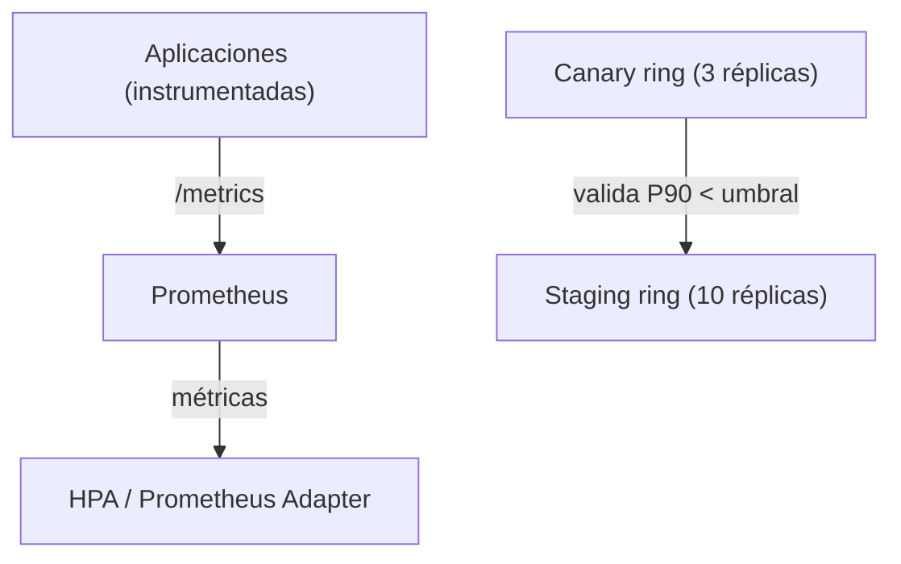

# Caso de uso: Observabilidad

## Problema

En un clúster con muchos microservicios, entender el estado del sistema requiere **métricas, logs y trazabilidad**. Además, el despliegue de nuevas versiones debe ser **seguro y validado**: idealmente, una versión nueva solo se promueve si las métricas (latencia, errores) siguen dentro de umbrales.

## Solución en Kubernetes

| Primitiva | Rol en observabilidad |
| --- | --- |
| **Metrics Server** | Métricas básicas de CPU/memoria de nodos y Pods (`kubectl top`, HPA). |
| **Prometheus (Operador)** | Recolección de métricas del clúster y las aplicaciones; es el estándar de facto. |
| **Deployment + estrategias de rollout** | Canary, blue/green, staged rollout para lanzamientos controlados. |
| **Validación con métricas** | Bloquear la promoción de un ring si la latencia P90 supera un umbral. |
| **HPA** | Escalar según métricas personalizadas (Prometheus Adapter). |

Conceptos de referencia: [09-addons.md](../arquitectura/09-addons.md), [16-extensiones.md](../arquitectura/16-extensiones.md) (Prometheus Operator), [04-kube-controller-manager.md](../arquitectura/04-kube-controller-manager.md).

## Arquitectura de referencia



## Ejemplo real: Rollout escalonado controlado por Prometheus (pulumi/examples)

El ejemplo [kubernetes-ts-staged-rollout-with-prometheus](https://github.com/pulumi/examples/tree/master/kubernetes-ts-staged-rollout-with-prometheus) demuestra un **despliegue escalonado con compuerta (gate) basada en métricas**:

1. Despliega **Prometheus** usando un **chart de Helm** (recolecta métricas del clúster: node-exporter, kube-state-metrics, alertmanager, etc.).
2. Despliega la aplicación en **dos rings**:
   - **Canary** (`canary-example-app`, 1 réplica): valida la nueva versión.
   - **Staging** (`staging-example-app`, 10 réplicas): escala al resto.

La **compuerta** bloquea la creación del ring de staging hasta que la métrica del canary es saludable. En el código, la validación se expresa como una anotación cuyo valor es un `Promise` que consulta Prometheus:

```typescript
// Check P90 latency is < 100,000 microseconds. The Promise must resolve
// correctly before this deployment rolls out.
"example.com/p90ResponseTime": util.checkHttpLatency(canary, containerName, {
    durationSeconds: 60,
    quantile: 0.9,
    thresholdMicroseconds: 100000,
    prometheusEndpoint: `localhost:${localPort}`,
})
```

El resultado reporta la métrica validada:

```text
---outputs:---
+ p90ResponseTime: "8221.236"
```

Este patrón compone:

- **Helm** para desplegar Prometheus (empaquetado de la infraestructura de monitoreo).
- **Deployments** para los rings de la aplicación.
- **Prometheus** para las métricas (vía node-exporter, kube-state-metrics).
- **Pulumi** para coordinar el rollout con una **compuerta de validación** (solo promueve cuando la métrica cumple el umbral).

## Otros patrones relevantes

- **ConfigMap rollout** (`kubernetes-*-configmap-rollout`, `kubernetes-ts-s3-rollout`, `kubernetes-go-configmap-rollout`): despliega una **nueva versión** de un `ConfigMap` y fuerza el **re-rollout** de los Pods que lo consumen (p. ej., reiniciando con un checksum de la configuración). Útil para actualizar configuración sin tocar el código, y verificar el efecto con métricas.
- **HPA con métricas del clúster**: escalar réplicas en función de CPU, memoria o métricas personalizadas (Prometheus Adapter).

## Consideraciones

- **Metric Server vs. Prometheus**: Metrics Server da las métricas mínimas (top/HPA básico); Prometheus da series históricas y personalizadas.
- **Compuertas de despliegue**: validar latencia (P90/P99), tasa de errores y SLOs antes de promover un ring reduce el riesgo de regresiones en producción.
- **Instrumentación**: las apps deben exponer métricas en un endpoint `/metrics` compatible con Prometheus para que el patrón funcione.
- **Observación del propio clúster**: instalar node-exporter (DaemonSet, ver [12-workloads.md](../arquitectura/12-workloads.md)) y kube-state-metrics para métricas de nodos y objetos.
- **Secrets de monitoreo**: si se agrega alerting externo, las credenciales van en Secrets.
