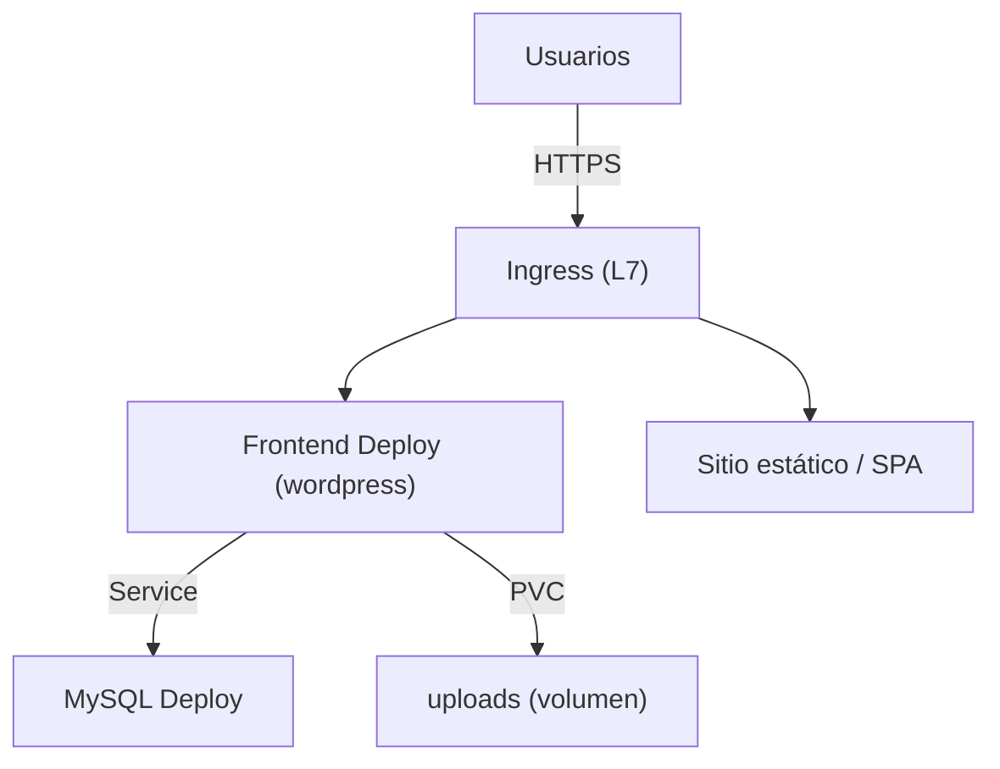

# Caso de uso: Aplicaciones web y CMS

## Problema

Desplegar aplicaciones web y CMS (como WordPress, sitios estáticos, o aplicaciones de varias capas) en Kubernetes implica:

- Exponer el **frontend** al tráfico externo (HTTPS).
- Conectar el **backend/API** y la **base de datos** de forma segura y estable.
- Publicar **contenido estático** (sitios, SPA) de forma eficiente.
- Gestionar **configuración y secretos** por entorno.

## Solución en Kubernetes

| Primitiva | Rol |
| --- | --- |
| **Deployment** | Frontend y backend contenedorizados con escalado y rollbacks. |
| **Service** | Comunicación estable interna entre capas. |
| **Ingress / Gateway API** | Ruteo L7 (path/host) del tráfico HTTP/HTTPS externo hacia los servicios. |
| **ConfigMap / Secret** | Configuración por entorno (URLs, credenciales de BBDD). |
| **PersistentVolume / PVC** | Contenido persistente (uploads de CMS, artefactos). |
| **Helm / Kustomize** | Empaquetado y parametrización de los manifiestos. |

Conceptos de referencia: [13-services.md](../arquitectura/13-services.md), [14-ingress-y-gateway-api.md](../arquitectura/14-ingress-y-gateway-api.md), [12-workloads.md](../arquitectura/12-workloads.md).

## Arquitectura de referencia (WordPress típico)



## Ejemplos reales

### Helm Charts (pulumi/examples)

Los ejemplos `kubernetes-*-helm-wordpress` y `kubernetes-*-helm-release-wordpress` despliegan **WordPress con el chart oficial de Helm**:

```sh
pulumi up
```

Pulumi instala el chart de Helm, que a su vez crea de forma declarativa todos los recursos (Deployments, Services, Secrets para la base de datos, PVCs). Esto demuestra un patrón clave para CMS en producción: **usar Helm charts** para empaquetar la complejidad y evitar mantener cientos de líneas de YAML a mano.

Recursos que típicamente genera el chart de WordPress:

- Deployment de WordPress (frontend PHP).
- Deployment de MariaDB/MySQL (backend stateful).
- Secrets con credenciales.
- Persistence (PVC) para `/var/www/html` y los uploads.
- Service + exposición externa.

### Sitios estáticos y webserver (nginx)

Los ejemplos `kubernetes-*-nginx` y `kubernetes-*-exposed-deployment` despliegan un **servidor nginx** y lo exponen con un Service:

- `kubernetes-py-exposed-deployment` / `kubernetes-ts-exposed-deployment`: crean un Deployment de nginx y un `Service` para exponerlo.
- `kubernetes-py-nginx` / `kubernetes-ts-nginx`: variantes del mismo patrón.

Este es el punto de partida más simple para una app web: **Deployment + Service**.

### Despliegues multicapa con BBDD

- `aws-ts-k8s-mern-voting-app`, `aws-ts-k8s-voting-app`: aplicaciones de votación multicapa (frontend + backend + base de datos) que muestran el patrón completo de una web app con persistencia.
- `gcp-ts-k8s-ruby-on-rails-postgresql`: una app Rails típica con PostgreSQL, ilustrando **web app + base de datos relacional** en Kubernetes.
- `aws-cs-ansible-wordpress` / `aws-py-wordpress-fargate-rds`: WordPress donde la BBDD se delega a un servicio gestionado (RDS) en lugar de correr dentro del clúster — buena separación entre stateless (en Kubernetes) y stateful (gestionado).

## Consideraciones

- **App stateless, datos gestionados**: una práctica común es mantener en Kubernetes solo la capa **stateless** (frontend/backend) y usar BBDD gestionadas (RDS, CloudSQL) fuera del clúster. Reduce el esfuerzo operativo del estado.
- **Ruteo L7**: para múltiples dominios/paths usar Ingress o Gateway API; el Service por sí solo solo hace balanceo L4.
- **Persistencia de uploads**: en CMS como WordPress, el contenido subido debe ir en un volumen compartido o almacenamiento objeto, no en el filesystem local de un Pod efímero.
- **TLS**: el Ingress/controlador debe terminar TLS; delegar la gestión de certificados (p. ej. cert-manager) para HTTPS automático.
- **Empaquetado**: Helm/Kustomize facilitan la parametrización por entorno (dev/staging/prod) sin duplicar manifiestos.
