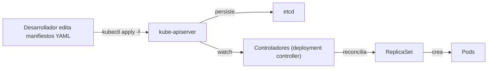

# Despliegue de aplicaciones: manifiestos y kubectl apply

## Introducción

Desplegar una aplicación en Kubernetes consiste en definir su **estado deseado** en manifiestos YAML (objetos: Deployment, Service, ConfigMap, etc.) y enviarlos al API server. Este es el enfoque **declarativo** de Kubernetes (ver [10-objetos-y-recursos.md](../arquitectura/10-objetos-y-recursos.md)).

## Flujo de despliegue base



Paso a paso:

1. **Definir** el estado deseado en un manifiesto (p. ej. `deployment.yaml`).
2. **Aplicar** con `kubectl apply -f deployment.yaml` (ver [comandos/09-operaciones-avanzadas.md](../comandos/09-operaciones-avanzadas.md)).
3. El **API server** valida, autentica/autoriza y persiste el objeto en etcd.
4. El **Deployment controller** (ver [04-kube-controller-manager.md](../arquitectura/04-kube-controller-manager.md)) crea el ReplicaSet, que crea los Pods.
5. El **scheduler** asigna los Pods a nodos y el **kubelet** crea los contenedores (ver [03-kube-scheduler.md](../arquitectura/03-kube-scheduler.md) y [06-kubelet.md](../arquitectura/06-kubelet.md)).

## Estructura típica de un despliegue

```text
app/
├── deployment.yaml      # la aplicación (réplicas, imagen, probes, recursos)
├── service.yaml         # exposición interna/externa
├── configmap.yaml       # configuración no sensible
├── secret.yaml          # credenciales
└── ingress.yaml         # ruteo L7 (opcional)
```

### Ejemplo mínimo

```yaml
# deployment.yaml
apiVersion: apps/v1
kind: Deployment
metadata:
  name: mi-app
spec:
  replicas: 3
  selector:
    matchLabels:
      app: mi-app
  template:
    metadata:
      labels:
        app: mi-app
    spec:
      containers:
      - name: app
        image: nginx:1.14.2
        ports:
        - containerPort: 80
```

```text
kubectl apply -f deployment.yaml
kubectl get deployments
```

## Estrategias de actualización (rollout)

El Deployment define **cómo** se actualiza a una nueva versión:

| Estrategia | Comportamiento | Uso |
| --- | --- | --- |
| **RollingUpdate** (por defecto) | Reemplaza Pods de a poco; sin downtime | Aplicaciones stateless en producción |
| **Recreate** | Elimina todos los Pods y luego crea los nuevos | Ambientes donde el downtime es aceptable o hay locks |
| **Canary / Blue-Green** (via tooling) | Rings controlados / doble versión + corte de tráfico | Releases validados con métricas (ver [casos-de-uso/observabilidad.md](../casos-de-uso/observabilidad.md)) |

Operación del rollout con kubectl: `rollout status`, `rollout history`, `rollout undo` — ver [comandos/04-workloads.md](../comandos/04-workloads.md).

## Buenas prácticas al desplegar

- **Declarativo, no imperativo**: usar `kubectl apply` con manifiestos versionados, no `kubectl create/expose/scale` a mano.
- **Reproducible**: los manifiestos viven en Git; el estado debe poder recrearse desde cero.
- **Recursos (requests/limits)**: siempre definir requests y limits de CPU/memoria para estabilidad y scheduling correcto.
- **Probes**: definir readiness/liveness/startup para el tráfico y el reinicio automático (ver [comandos/08-salud-y-monitoreo.md](../comandos/08-salud-y-monitoreo.md)).
- **Configuración y secretos**: separar ConfigMaps/Secrets del código (ver [comandos/06-configuracion.md](../comandos/06-configuracion.md)).

## Límites del enfoque "YAML a mano"

A medida que crecen las aplicaciones, mantener YAML puro se vuelve complejo:

- Duplicación entre entornos (dev/staging/prod).
- Parametrización de imágenes, réplicas, dominios.
- Gestión de releases y rollbacks de charts completos.

Para eso existen **Helm** y **Kustomize** (siguiente documento), y para automatización **GitOps** (el posterior).

## Resumen

| Concepto | Detalle |
| --- | --- |
| Enfoque | Declarativo: definir estado deseado en YAML y aplicar |
| Comando clave | `kubectl apply -f <manifiesto>` |
| Objetos típicos | Deployment, Service, ConfigMap, Secret, Ingress |
| Rollout | RollingUpdate (default), Recreate, canary/blue-green |
| Buenas prácticas | Manifiestos en Git, requests/limits, probes, separar config |