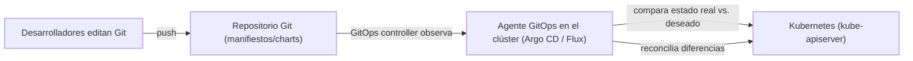

# GitOps: Argo CD y Flux

## Introducción

**GitOps** es una práctica que usa **Git como única fuente de verdad** para la infraestructura declarativa y el código de las aplicaciones. En vez de ejecutar `kubectl apply` manualmente (o con scripts), un **operador dentro del clúster observa el repositorio Git** y **reconcilia** el clúster para que coincida con lo definido en el repo.

## Cómo funciona



Ciclo GitOps:

1. **Declarar**: los manifiestos (YAML, Kustomize, Helm) viven en Git.
2. **Observar**: el agente GitOps (Argo CD o Flux) **vigila** el repo y detecta cambios.
3. **Reconciliar**: cuando el repo cambia (o el clúster se desvía), el agente aplica la configuración para que el clúster coincida con Git.
4. **Corregir la deriva (drift)**: si alguien cambia algo manualmente en el clúster, el agente lo **revierte** al estado definido en Git.

## Beneficios

- **Auditoría y revisión**: todo cambio pasa por pull request; el historial queda en Git.
- **Rollback inmediato**: revertir un cambio = revertir el commit.
- **Reproducibilidad**: el clúster se recrea desde el repo en cero.
- **Seguridad**: menos acceso interactivo al clúster; el agente usa una cuenta de servicio con permisos acotados.
- **Auto-reparación**: la deriva de configuración se corrige automáticamente.

## Argo CD

[Argo CD](https://argo-cd.readthedocs.io/) es la herramienta GitOps más popular.

### Conceptos clave

| Concepto | Descripción |
| --- | --- |
| **Application** | El CR que conecta un repo/path con un clúster destino; define qué desplegar y dónde. |
| **Project** | Agrupa Applications y define políticas (destinos permitidos, fuentes). |
| **Sync** | El proceso de aplicar el estado del repo al clúster. |
| **Sync Policy** | Automática (sync al detectar cambios) o manual. |
| **App of Apps** | Patrón donde una Application despliega otras Applications. |

### Flujo típico

```text
# 1. Instalar Argo CD en el clúster (chart Helm)
helm repo add argo https://argoproj.github.io/argo-helm
helm install argocd argo/argo-cd

# 2. Acceso web / CLI
kubectl port-forward svc/argocd-server 8080:443

# 3. Definir una Application (declarativa, en Git)
kubectl apply -f application.yaml   # o se registra con argocd app create
```

```yaml
# application.yaml
apiVersion: argoproj.io/v1alpha1
kind: Application
metadata:
  name: mi-app
  namespace: argocd
spec:
  project: default
  source:
    repoURL: https://github.com/mi-org/mi-app-config
    path: overlays/prod          # puede apuntar a Helm charts o Kustomize
    targetRevision: main
  destination:
    server: https://kubernetes.default.svc
    namespace: prod
  syncPolicy:
    automated:                   # sync automático
      prune: true                # borra recursos eliminados de Git
      selfHeal: true             # corrige la deriva
```

> Las **Applications** de Argo CD pueden apuntar a **kustomize**, **Helm** o YAML puro; la herramienta internamente ejecuta el renderizado y aplica el resultado.

## Flux

[Flux](https://fluxcd.io/) es el GitOps de *Cloud Native Computing Foundation* (CNCF), orientado a GitOps completo (apps + infra).

### Conceptos clave

| Concepto | Descripción |
| --- | --- |
| **Source** | De dónde viene la configuración: `GitRepository`, `HelmRepository`, `OCIRepository` (charts en OCI). |
| **Kustomization** | Define qué aplicar de una Source y con qué políticas (destino, prune, interval). |
| **HelmRelease** | Gestiona releases de Helm declarativamente (chart + valores), con `HelmRepository` como fuente. |
| **Image Automation** | Actualiza tags de imágenes en Git automáticamente (ImagePolicy + ImageUpdateAutomation). |

> Flux tiene una filosofía más "composable" que Argo CD: separa la fuente (Source), la aplicación (Kustomization/HelmRelease) y la automatización de imágenes.

## Argo CD vs. Flux

| Aspecto | Argo CD | Flux |
| --- | --- | --- |
| Curva de aprendizaje | UI y CLI amigables; muy popular | Más "Kubernetes-native", CRs componibles |
| UI / Dashboard | Excelente (integrada) | Básica; se suele combinar con Weave GitOps |
| Helm | Soporta charts (sync como resultado) | HelmRelease nativo, mejor control |
| Automatización de imágenes | Vía tools externas o plugins | Integrada (Image Automation) |
| Multi-clúster | Muy usado (hub-and-spoke) | Soporte vía Flux controllers por clúster |
| Filosofía | "Application" centrada | "Sources + Kustomizations + Reconciliers" |

## GitOps y el resto del pipeline

- **CI separado de CD**: el CI (build + test) produce la imagen y actualiza el manifiesto en Git; el CD (GitOps) despliega detectando el cambio. El CI puede ser Jenkins (ver [casos-de-uso/ci-cd.md](../casos-de-uso/ci-cd.md)) o cualquier pipeline externo.
- **Progressive delivery**: Argo Rollouts (canary/blue-green con análisis de métricas) extiende Argo CD para releases validados (relacionado con [casos-de-uso/observabilidad.md](../casos-de-uso/observabilidad.md)).
- **Multicluster**: se usa GitOps para propagar la misma configuración a varios clústeres (dev, staging, prod, regiones).

## Resumen

| Concepto | Detalle |
| --- | --- |
| Principio | Git como fuente única de verdad; el agente reconcilia |
| Beneficios | Auditoría, rollback, reproducibilidad, auto-reparación |
| Argo CD | Applications + Projects + Sync; popular, con UI |
| Flux | Sources + Kustomization/HelmRelease + Image Automation; composable |
| Relación con CI | CI builda la imagen, GitOps despliega al detectar el cambio |