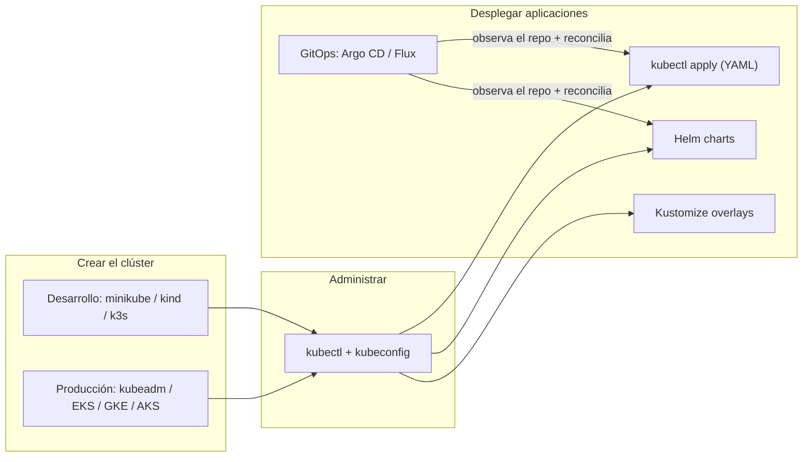

# Despliegue de Kubernetes

## Introducción

Esta sección documenta **cómo se despliega Kubernetes** en dos dimensiones complementarias:

1. **Desplegar el clúster** (setup): las distintas formas de crear y administrar un clúster de Kubernetes, desde desarrollo local hasta producción multi-nodo.
2. **Desplegar aplicaciones** sobre el clúster: cómo se publica y actualiza el software, desde `kubectl apply` hasta templating (Helm/Kustomize) y GitOps (Argo CD, Flux).

Y cómo Kubernetes **se asocia con otras herramientas** del ecosistema en cada etapa.

## Índice de documentos

| Documento | Contenido |
| --- | --- |
| [01-setup-cluster.md](01-setup-cluster.md) | Cómo crear un clúster: local (minikube, kind, k3s) y de producción (kubeadm, gestión en nube) |
| [02-herramientas-cluster.md](02-herramientas-cluster.md) | Herramientas para administrar el clúster: kubectl, kubeconfig, operación diaria |
| [03-despliegue-aplicaciones.md](03-despliegue-aplicaciones.md) | Publicar aplicaciones: manifiestos YAML, `kubectl apply`, estrategias de rollout |
| [04-helm-y-kustomize.md](04-helm-y-kustomize.md) | Empaquetado y configuración: Helm charts y Kustomize overlays |
| [05-gitops.md](05-gitops.md) | GitOps: Argo CD y Flux, Git como fuente única de verdad |

## Visión de conjunto

## Relación con otras secciones

- **Arquitectura**: los componentes y el modelo de objetos que se gestionan con estas herramientas están en [`../arquitectura/README.md`](../arquitectura/README.md).
- **Casos de uso**: ejemplos de qué se despliega (microservicios, IA, BBDD, etc.) en [`../casos-de-uso/README.md`](../casos-de-uso/README.md).
- **Comandos**: referencia de `kubectl` para ejecutar estos despliegues en [`../comandos/README.md`](../comandos/README.md).