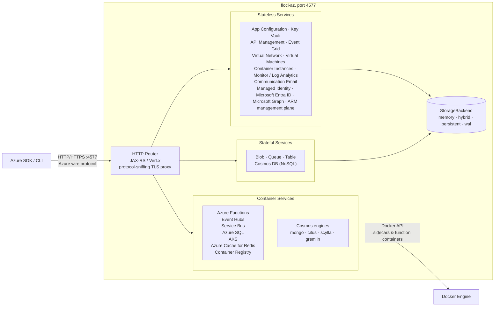

# Floci-AZ

**Cualquier nube, en local.**

Ligero, esponjoso y siempre gratuito.
Sin cuenta. Sin token de autenticación. Sin feature gates. Solo `docker compose up`.

Floci-AZ es un emulador local de servicios de Azure, gratuito y de código
abierto, para desarrollo, pruebas y CI. Corre en un único binario nativo
multi-arquitectura y expone todos los servicios en el puerto `4577`.

---

## Qué es Floci-AZ

Floci-AZ es un emulador local de Azure para desarrollo, pruebas y CI, gratuito y de código abierto.

Te ofrece servicios compatibles con Azure en tu máquina sin necesidad de una cuenta en la nube, un token de autenticación ni feature gates de pago. Apunta tu Azure SDK, CLI o Terraform a `http://localhost:4577` y conserva tus flujos de trabajo actuales.

Floci-AZ es el miembro de Azure de la familia de emuladores [Floci](https://github.com/floci-io).

| Emulador | Cloud | Puerto |
|---|---|:---:|
| [floci](https://github.com/floci-io/floci) | AWS | 4566 |
| **[floci-az](https://github.com/floci-io/floci-az)** | **Azure** | **4577** |
| [floci-gcp](https://github.com/floci-io/floci-gcp) | GCP | 4588 |
| [floci-oci](https://github.com/floci-io/floci-oci) | OCI | 4599 |

## Inicio rápido

```yaml
# docker-compose.yml
services:
  floci-az:
    image: floci/floci-az:latest
    ports:
      - "4577:4577"
    volumes:
      - /var/run/docker.sock:/var/run/docker.sock  # required for Azure Functions
```

```bash
docker compose up
```

O ejecutarlo directamente:

```bash
docker run -d --name floci-az \
  -p 4577:4577 \
  -v /var/run/docker.sock:/var/run/docker.sock \
  floci/floci-az:latest
```

Todos los servicios están disponibles en `http://localhost:4577`. Usa cualquier nombre de cuenta y clave: en el modo de auth `dev` las credenciales no se validan.

> **Azure Functions** requiere acceso al socket de Docker para que Floci-AZ pueda crear los contenedores de runtime bajo demanda. Monta `/var/run/docker.sock` como se muestra arriba. Si no usas Functions, el montaje del socket es opcional.

### TLS (para el SDK de Java de Cosmos DB)

El SDK de Azure Cosmos DB para Java impone TLS en modo gateway. Habilita el proxy TLS integrado para servir HTTP y HTTPS en el mismo puerto:

```yaml
# docker-compose.yml
services:
  floci-az:
    image: floci/floci-az:latest
    ports:
      - "4577:4577"
    volumes:
      - /var/run/docker.sock:/var/run/docker.sock
      - ./data:/app/data        # persist generated cert across restarts
    environment:
      FLOCI_AZ_TLS_ENABLED: "true"
      FLOCI_AZ_HOSTNAME: floci-az   # add Docker service name to cert SANs
```

El certificado autofirmado se genera al arrancar y se cachea bajo `data/tls/`. Puedes obtenerlo en runtime desde `GET http://localhost:4577/_floci/tls-cert` para instalarlo en tu truststore: no hay certificado estático que empaquetar ni importar manualmente.

> **Terraform / OpenTofu (azurerm) también requiere TLS.** El proveedor descubre el cloud por HTTPS (`GET https://<host>/metadata/endpoints`), así que falla contra HTTP plano. Consulta la [guía de Terraform / OpenTofu](https://floci.io/floci-az/terraform/).

## Características

### Azure local sin la cuenta en la nube

Ejecuta servicios compatibles con Azure localmente sin una cuenta de Azure, token de autenticación ni feature gates de pago.

### Docker real donde la fidelidad importa

Azure Functions, Event Hubs y las APIs de motores de Cosmos DB (MongoDB, PostgreSQL, Cassandra, Gremlin) usan ejecución real respaldada por Docker en lugar de mocks superficiales.

### Compatibilidad lista para usar con el Azure SDK

Apunta los clientes estándar del Azure SDK a `http://localhost:4577`. Las cadenas de conexión, credenciales y flujos de trabajo del SDK existentes se mantienen sin cambios.

### Rápido para CI

La imagen nativa arranca en milisegundos y mantiene bajo el uso de memoria en reposo, lo que lo hace práctico para el desarrollo local y los pipelines de prueba.

### Persistencia configurable

Elige entre los modos de almacenamiento en memoria, persistente, híbrido y write-ahead log según el perfil de durabilidad que necesites.

## ¿Por qué Floci-AZ?

Floci-AZ te ofrece más servicios que las herramientas locales oficiales, consolidados en un único puerto, con una imagen nativa que arranca en milisegundos.

| Característica             | Floci-AZ                    | [Azurite](https://github.com/Azure/Azurite) | [Functions Core Tools](https://github.com/Azure/azure-functions-core-tools) |
|----------------------------|-----------------------------|---------------------------------------------|-----------------------------------------------------------------------------|
| Blob Storage               | ✅                           | ✅                                           | ❌                                                                           |
| Queue Storage              | ✅                           | ✅                                           | ❌                                                                           |
| Table Storage              | ✅                           | ✅                                           | ❌                                                                           |
| Azure Functions            | ✅                           | ❌                                           | ✅                                                                           |
| App Configuration          | ✅                           | ❌                                           | ❌                                                                           |
| Cosmos DB (SQL API)        | ✅                           | ❌                                           | ❌                                                                           |
| Key Vault                  | ✅                           | ❌                                           | ❌                                                                           |
| Event Hubs                 | ✅                           | ❌                                           | ❌                                                                           |
| Service Bus                | ✅                           | ❌                                           | ❌                                                                           |
| Azure SQL Database         | ✅                           | ❌                                           | ❌                                                                           |
| Azure DB for PostgreSQL    | ✅                           | ❌                                           | ❌                                                                           |
| AKS (Kubernetes)           | ✅                           | ❌                                           | ❌                                                                           |
| Container Apps             | ✅                           | ❌                                           | ❌                                                                           |
| API Management             | ✅                           | ❌                                           | ❌                                                                           |
| Virtual Machines           | ✅                           | ❌                                           | ❌                                                                           |
| Azure Cache for Redis      | ✅                           | ❌                                           | ❌                                                                           |
| Container Registry         | ✅                           | ❌                                           | ❌                                                                           |
| Container Instances        | ✅                           | ❌                                           | ❌                                                                           |
| Event Grid                 | ✅                           | ❌                                           | ❌                                                                           |
| Azure Monitor / Logs       | ✅                           | ❌                                           | ❌                                                                           |
| Communication Email        | ✅                           | ❌                                           | ❌                                                                           |
| Managed Identity           | ✅                           | ❌                                           | ❌                                                                           |
| Microsoft Entra ID         | ✅                           | ❌                                           | ❌                                                                           |
| Microsoft Graph            | ✅                           | ❌                                           | ❌                                                                           |
| Binario nativo             | ✅                           | ❌                                           | ✅                                                                           |
| Puerto unificado           | ✅ (4577)                    | ❌                                           | ❌                                                                           |
| Modos de almacenamiento    | ✅ (persistent/WAL/Hybrid)   | ❌                                           | ❌                                                                           |
| Tiempo de arranque         | **<100ms** (imagen nativa)  | Moderado                                    | Rápido                                                                        |
| Licencia                   | **MIT**                     | MIT                                         | MIT                                                                         |

### Emulador de Azure Cosmos DB vs Floci-AZ

#### ¿Qué es el emulador de Azure Cosmos DB?

El [emulador de Azure Cosmos DB](https://learn.microsoft.com/en-us/azure/cosmos-db/emulator) es el emulador local oficial de Microsoft para Cosmos DB. Se distribuye como instalador de Windows o como imagen de Docker de **contenedor de Windows**, expone una UI integrada de Data Explorer y soporta varias APIs de Cosmos DB (SQL, MongoDB, Cassandra, Gremlin, Table). Es una réplica fiel del servicio en la nube, pero arrastra todo el peso de esa fidelidad.

#### Comparación directa

| Característica                     | Emulador de Azure Cosmos DB                              | Floci-AZ                                                                                                                |
|------------------------------------|----------------------------------------------------------|-------------------------------------------------------------------------------------------------------------------------|
| **Plataforma**                     | Windows primero (históricamente requería contenedores de Windows) | Contenedores nativos de Linux: corre en Mac, Linux y Windows                                           |
| **Tamaño de imagen de Docker**     | Pesado (~GBs según la versión/imagen base)               | Motores modulares ligeros (~50 MB a unos cientos de MB según las APIs seleccionadas)                                    |
| **Tiempo de arranque**             | Arranque lento (decenas de segundos)                     | Arranque bajo demanda: solo levanta el motor de la API de Cosmos requerida                                              |
| **RAM requerida**                  | Alto uso de memoria (comúnmente ≥ 2 GB)                  | Huella mínima: solo los motores activos consumen recursos                                                               |
| **APIs de Cosmos DB**              | SQL (NoSQL), MongoDB, Cassandra, Gremlin, Table          | SQL (NoSQL), MongoDB, PostgreSQL, Cassandra, Gremlin, Table                                                             |
| **Implementación de las APIs de Cosmos** | Emulador propietario de Microsoft                  | Motores de compatibilidad específicos por API                                                                          |
| **Proveedor de API NoSQL / SQL**   | Emulador de Cosmos nativo                                | 🟢 Motor integrado en proceso: dialecto SQL completo, sin Docker, arranque instantáneo                                   |
| **Proveedor de API MongoDB**       | Emulador de Cosmos nativo                                | 🟢 MongoDB Community Server: protocolo wire idéntico (BSON + OP_MSG)                                                    |
| **Proveedor de API PostgreSQL**    | Emulador de Cosmos nativo                                | 🟢 Citus (el mismo motor que corre Azure): driver JDBC estándar, cero cambios de código                                  |
| **Proveedor de API Cassandra**     | Emulador de Cosmos nativo                                | 🟢 ScyllaDB: compatible con CQL, mismo driver DataStax                                                                   |
| **Proveedor de API Gremlin**       | Emulador de Cosmos nativo                                | 🟡 Apache TinkerPop: los traversals estándar funcionan; las extensiones de Cosmos no se emulan                            |
| **Proveedor de API Table**         | Emulador de Cosmos nativo                                | 🟢 En memoria (integrado): mismo SDK `azure-data-tables`, sin Docker                                                     |
| **Otros servicios de Azure**       | Solo Cosmos DB                                           | Blob · Queue · Table · Functions · App Config · Cosmos DB en un stack local unificado de Azure                            |
| **HTTPS / certificados**           | Se requieren certificados autofirmados: hay que importarlos en el trust store del SO/JVM o deshabilitar la validación | HTTP plano en `4577` por defecto. TLS opcional: configura `FLOCI_AZ_TLS_ENABLED=true` y HTTP y HTTPS se sirven en el mismo puerto `4577` vía proxy con protocol sniffing; certificado autofirmado generado en runtime, sin certificado estático incluido, disponible en `GET /_floci/tls-cert` |
| **Web UI / Data Explorer**         | ✅ Integrada                                             | ❌ Entorno de desarrollo local orientado a API                                                                            |
| **Código abierto**                 | ❌ Propietario                                           | ✅ MIT                                                                                                                   |
| **Amabilidad con CI/CD**           | ⚠️ Imágenes pesadas y pipelines más lentos               | ✅ Arranque rápido y contenedores amigables con Linux                                                                     |
| **Modelo de arranque**             | Levanta todo el stack del emulador                       | Levanta solo el motor de la API de Cosmos solicitada                                                                     |
| **Estrategia de contenedores**     | Emulador monolítico                                      | Arquitectura modular basada en proveedores                                                                               |
| **Filosofía de abstracción en la nube** | Emulador específico de Cosmos                       | Abstracción unificada de la nube vía floci                                                                               |
| **Objetivo principal**             | Emulador local oficial de Cosmos                         | Desarrollo local ligero compatible con Azure y testing de integración                                                     |
| **Paridad de comportamiento**      | Mayor paridad de comportamiento específico de Azure      | Alta compatibilidad de protocolo/API, no emulación completa de la infraestructura de Azure                                |
| **RU/s y distribución global**     | Simulación parcial                                       | ❌ No completamente emuladas                                                                                             |
| **Replicación multi-región**       | Soporte parcial                                          | ❌ No emulada                                                                                                            |
| **Semántica de consistencia**      | Orientada a Azure                                        | Compatibilidad best-effort según el motor                                                                                |
| **Uso recomendado**                | Flujos de trabajo locales completos centrados en Cosmos  | Desarrollo local rápido, testing, CI/CD y flujos ligeros de integración con Azure                                         |

> Floci-AZ no pretende reproducir completamente los internals de Azure Cosmos DB ni el comportamiento de la infraestructura en la nube.
>
> El objetivo es ofrecer alta compatibilidad de protocolo y SDK mediante motores locales específicos por API, optimizados para:
>
> - desarrollo local
> - testing de integración
> - pipelines de CI/CD
> - entornos de desarrollo ligeros
>
> Cada API de Cosmos está respaldada por el motor que más se aproxima a su protocolo y al comportamiento de su driver.
>
> Las características exactas de Azure, como:
>
> - semántica de throughput RU/s
> - distribución global
> - replicación multi-región
> - autoscaling
> - garantías de consistencia exactas
> - comportamiento interno de la infraestructura de Azure
>
> se consideran intencionalmente fuera de alcance.

#### Cuándo elegir cuál

**Usa el emulador oficial cuando necesites:**

- Fidelidad total con el protocolo wire de Cosmos DB y características avanzadas (stored procedures, triggers, change feed, TTL, gobernanza de RU/s y simulación de topología multi-región).
- La UI de Data Explorer para la inspección manual de datos.

**Usa Floci-AZ cuando necesites:**

- Un entorno dev/test ligero y multiplataforma que arranca en milisegundos.
- Pipelines de CI/CD con runners Linux (GitHub Actions, GitLab CI, CircleCI, etc.).
- Varios servicios de Azure en un solo contenedor: sin tener que coordinar emuladores separados.
- Sin dolores de cabeza con certificados TLS.
- Que la cobertura de la API SQL de Cosmos DB sea suficiente (CRUD, consultas SQL, PATCH, batch transaccional, paginación, agregados, funciones de string).

## Resumen de arquitectura



## Servicios compatibles

| Servicio                 | Enrutamiento                      | Operaciones notables                                                                                                                                                                                                                                                                |
|--------------------------|-----------------------------------|-------------------------------------------------------------------------------------------------------------------------------------------------------------------------------------------------------------------------------------------------------------------------------------|
| **Blob Storage**         | `/{account}/`                     | Crear/eliminar contenedores, subir/descargar/eliminar blobs, listar blobs; operaciones de filesystem/path del DFS de ADLS Gen2 con compatibilidad con Hadoop ABFS 3.3.4; user delegation key/SAS                                                                                     |
| **Queue Storage**        | `/{account}-queue/`               | Crear/eliminar colas, enviar/recibir/inspeccionar/eliminar mensajes, visibility timeout                                                                                                                                                                                             |
| **Table Storage**        | `/{account}-table/`               | Crear/eliminar tablas, insertar/obtener/actualizar/upsert/eliminar entidades; OData `$filter` / `$select` / `$top`; paginación del lado del servidor (continuation tokens); concurrencia optimista con ETag; Entity Group Transactions (`$batch`)                                     |
| **Azure Functions**      | `/{account}-functions/`           | Desplegar e invocar funciones activadas por HTTP (node, python, java, dotnet); pool de contenedores en caliente                                                                                                                                                                      |
| **App Configuration**    | `/{account}-appconfig/`           | Key-values, etiquetas, feature flags, instantáneas (provisión asíncrona), revisiones, bloqueos, ETags; paginación (`@nextLink`), filtrado `$select`, `tags`, time-travel con `Accept-Datetime`, `Sync-Token`                                                                        |
| **Cosmos DB (NoSQL)**    | `/{account}-cosmos/`              | Bases de datos, contenedores, CRUD de documentos + consultas SQL completas: siempre activo, sin Docker. PATCH; batch transaccional.                                                                                                                                                 |
| **Cosmos DB NoSQL (integrado)** | `/{account}-cosmos-nosql/`   | El mismo motor SQL integrado de arriba, expuesto como endpoint de motor con nombre. Opt-in con `FLOCI_AZ_SERVICES_COSMOS_ENGINES_NOSQL_ENABLED=true`; no requiere Docker.                                                                                                           |
| **Key Vault**            | `/{account}-keyvault/`            | CRUD de secretos, versionado, eliminación suave, actualización de propiedades; CRUD de claves, backup/restore, rotación, criptografía RSA/EC/oct (encrypt/decrypt/sign/verify/wrap/unwrap), `/rng`; Managed HSM (`/{account}-managedhsm/`)                                           |
| **Event Hubs**           | AMQP `:5672` / Kafka `:9093`      | AMQP 1.0 (sidecar Artemis), compatible con Kafka (Redpanda, opt-in)                                                                                                                                                                                                                 |
| **Service Bus**          | `/{account}-servicebus/` + AMQP `:5673` | Colas, topics, suscripciones (creadas dinámicamente); data plane AMQP 1.0 vía sidecar Artemis, o mock (solo management plane)                                                                                                                                               |
| **Azure SQL Database**   | Ruta ARM + `/{account}-sql/`      | Servidores, bases de datos, reglas de firewall; solo ARM por defecto, contenedores opcionales gestionados de SQL Server 2025                                                                                                                                                         |
| **Azure Database for PostgreSQL** | Ruta ARM (`Microsoft.DBforPostgreSQL`) + `/{account}-postgres/` | Servidores flexibles, bases de datos, reglas de firewall, configuraciones; contenedores `postgres:17-alpine` respaldados por Docker (sin EULA), asignación dinámica de puertos, o mock                                                                                |
| **Azure Database for MySQL** | Ruta ARM (`Microsoft.DBforMySQL`) + `/{account}-mysql/` | Servidores flexibles, bases de datos, reglas de firewall, configuraciones; contenedores `mysql:8.0` respaldados por Docker (sin EULA), asignación dinámica de puertos, o mock                                                                                            |
| **Azure Database for MariaDB** | Ruta ARM (`Microsoft.DBforMariaDB`) + `/{account}-mariadb/` | Servidores (modelo de servidor único), bases de datos, reglas de firewall, configuraciones; contenedores `mariadb:10.11` respaldados por Docker (sin EULA), asignación dinámica de puertos, o mock                                                                         |
| **Azure Kubernetes Service** | Ruta ARM (`Microsoft.ContainerService`) | CreateOrUpdate, Get, Delete, List, agent pools, kubeconfig (`listClusterAdminCredential`); contenedores k3s reales o mock                                                                                                                                                     |
| **Azure Container Apps** | Ruta ARM (`Microsoft.App`) + FQDN de app específico del environment | CRUD de environment/app gestionados, Single/Multiple revisions, secretos, réplicas min/max, ingress HTTP respaldado por Docker o mock                                                                                 |
| **API Management**       | Ruta ARM (`Microsoft.ApiManagement`) + `/{account}-apim/{service}/` | Emulador APIM en proceso para recursos ARM, enrutamiento de gateway, productos/suscripciones, named values, backends, importación OpenAPI y un subconjunto enfocado de políticas                                                                                                      |
| **Virtual Network**      | Ruta ARM (`Microsoft.Network`)    | Recursos ARM de VNet, subred, NIC, IP pública, NSG, zona DNS privada (+ virtual network links, record sets), private endpoint (+ private DNS zone groups) y private link service; el listado de subredes se limita a la VNet padre; las IPs privadas de las NIC se sintetizan para compatibilidad con VM/Terraform |
| **Virtual Machines**     | Ruta ARM (`Microsoft.Compute`)    | Ciclo de vida de VM (create/start/stop/deallocate/restart/delete/list), power state en instanceView; mock: sin Docker (backend de contenedor planificado)                                                                                                                             |
| **Azure Cache for Redis** | Ruta ARM (`Microsoft.Cache`)     | CRUD de caché, `listKeys`/`regenerateKey`; contenedores reales `valkey/valkey:8-alpine` (data plane, clave primaria como password) o mock; puerto no-SSL                                                                                                                             |
| **Azure Container Registry** | Ruta ARM (`Microsoft.ContainerRegistry`) | CRUD de registro, `listCredentials`/`regenerateCredential`, `checkNameAvailability`; un `registry:2` compartido (push/pull de Docker Registry V2, `loginServer` path-style, anónimo) o mock                                                                                         |
| **Azure Container Instances** | Ruta ARM (`Microsoft.ContainerInstance`) | Ciclo de vida de grupos de contenedores (create/update/delete/list por rg + suscripción), `start`/`stop`/`restart` con formas LRO exactas al spec, logs de contenedores, instanceView, read-backs seguros para azurerm (ports/resources siempre presentes, casing canónico de enums, secretos nunca reflejados); mock: sin Docker (backend de contenedor planificado) |
| **Event Grid**           | Ruta ARM (`Microsoft.EventGrid`) + `/{topic}-eventgrid/api/events` | Custom Topics, `listKeys`/`regenerateKey`, `eventSubscriptions` con webhook y filtros de subject/eventType; publicación en esquemas de Event Grid + CloudEvents 1.0; entrega asíncrona de webhooks con reintentos; handshake de `SubscriptionValidationEvent`; solo HTTP (sin sidecar) |
| **Azure Monitor / Log Analytics** | Ruta ARM (`Microsoft.OperationalInsights` / `Microsoft.Insights`) + `/dataCollectionRules/{id}/streams/{stream}` + `/v1/workspaces/{id}/query` | Workspaces, Data Collection Endpoints/Rules; Logs Ingestion API; consultas de Log Analytics con un subconjunto de KQL (`where`/`project`/`take`/`limit` + timespan); solo HTTP (sin sidecar) |
| **Communication Services Email** | `/emails:send` + `/emails/operations/{id}` + `/emailMessages` + ruta ARM (`Microsoft.Communication`) | Envío de ACS Email + polling de estado; buzón de inspección en memoria (estilo Mailpit `GET /emailMessages`); communication/email services + dominios vía ARM; captura mensajes localmente, sin entrega real; solo HTTP (sin sidecar) |
| **Managed Identity**     | Ruta ARM (`Microsoft.ManagedIdentity`) + `/metadata/identity/oauth2/token` | Identidades user-assigned (`principalId`/`clientId` generados por el servidor), credenciales de identidad federada, `identities/default` system-assigned; endpoint de tokens IMDS para `ManagedIdentityCredential` (apunta el SDK al emulador con `AZURE_POD_IDENTITY_AUTHORITY_HOST`); JWTs v1.0 firmados con la clave de Entra, verificables vía JWKS; solo HTTP (sin sidecar) |

### Detalles de API Management

Floci-AZ incluye un **emulador de API Management en proceso** pensado para desarrollo local, pruebas de compatibilidad con SDK y flujos de CI que necesitan recursos ARM con forma de APIM más un gateway ligero. No es una implementación completa del gateway de Azure APIM.

APIM está disponible a través de:

- Rutas de recursos compatibles con ARM bajo `Microsoft.ApiManagement`.
- Rutas de gateway bajo `/{account}-apim/{serviceName}/{apiPath...}`. Con la cuenta por defecto esto es `http://localhost:4577/devstoreaccount1-apim/{serviceName}/...`.

#### Compatible

- Recursos de servicio de gestión: create, get, list, delete.
- Recursos de API: create, get, list, delete.
- Recursos de operaciones: create, get, list, delete.
- Recursos de política en el ámbito de servicio, API y operación.
- Recursos de producto y enlaces de producto a API.
- Recursos de suscripción con enforcement de subscription-key en el gateway.
- Named values, incluidos los named values secretos cuyo `properties.value` no se expone en las respuestas ARM.
- Backends y `<set-backend-service backend-id="...">`.
- Importación de OpenAPI JSON para APIs, incluida la generación de operaciones desde `paths`.
- Comportamiento de reimportación de OpenAPI que reemplaza las operaciones generadas anteriores.
- Coincidencia de rutas de gateway para paths de API y plantillas de URL de operaciones.
- Proxy básico de backends cuando se configura un `serviceUrl` de API o una política de backend.

#### Subconjunto de políticas compatible

El motor de políticas soporta intencionalmente un subconjunto enfocado:

- `<set-header>` con `exists-action="override"`, `skip`, `append` y `delete`.
- `<set-query-parameter>` con `exists-action="override"`, `skip` y `delete`.
- `<rewrite-uri template="...">`.
- `<set-backend-service base-url="...">`.
- `<set-backend-service backend-id="...">`.
- `<return-response>`.
- `<set-status code="...">` dentro de `return-response`.
- `<set-body>` dentro de `return-response`.
- Interpolación de named values con `{{name}}` en los valores de política compatibles.

#### Parcial o fuera de alcance

El emulador de APIM está intencionalmente acotado. Estas características no se emulan por completo:

- El lenguaje completo de políticas de APIM y las expresiones de política C#.
- Validación de JWT, flujos OAuth/OIDC, certificados, mTLS e identidades gestionadas.
- API revisions, API versions, version sets, releases, tags, groups, users, loggers, diagnostics, referencias a Key Vault en named values y comportamiento del portal de desarrollo.
- Networking de APIM, private endpoints, custom domains, DNS, scale units, regiones, comportamiento de SKU y timing del ciclo de vida del despliegue.
- Formatos de error exactos de APIM, tracing, analytics, caching, contadores de rate-limit, contadores de quota y comportamiento distribuido del gateway.

El objetivo actual es la paridad local práctica para el provisionamiento común de APIM y las pruebas de gateway, no la simulación completa de la infraestructura de Azure.

## Integración con SDK

Floci-AZ usa routing por path:

| Servicio           | Endpoint                                              | Notas |
|--------------------|-------------------------------------------------------|-------|
| Blob               | `http://localhost:4577/{accountName}`                 | |
| Data Lake Storage Gen2 | `http://localhost:4577/{accountName}`            | Usa el Host header `{accountName}.dfs.core.windows.net`; se mapea al backend de Blob y soporta flujos de filesystem/path de Hadoop ABFS 3.3.4, incluidos detección de HNS, create/overwrite condicional, properties/XAttrs, metadatos ACL, leases, append/flush, listing, status, rename y delete |
| Queue              | `http://localhost:4577/{accountName}-queue`           | |
| Table              | `http://localhost:4577/{accountName}-table`           | |
| Functions          | `http://localhost:4577/{accountName}-functions`       | |
| App Configuration  | `http://localhost:4577/{accountName}-appconfig`       | Algunos SDK requieren una URL `https://`: usa una transport policy `ForceHttp` para reescribir a HTTP |
| Cosmos DB          | `http://localhost:4577/{accountName}-cosmos`          | SDK de Python / Node. **SDK de Java:** habilita TLS (`FLOCI_AZ_TLS_ENABLED=true`) y usa `https://localhost:4577`: el SDK fuerza TLS; el certificado se autogenera en runtime, obtenlo desde `GET /_floci/tls-cert` |
| Key Vault          | `http://localhost:4577/{accountName}-keyvault`        | Algunos SDK requieren una URL `https://`: usa una transport policy `ForceHttp` para reescribir a HTTP |
| Event Hubs         | AMQP `amqp://localhost:5672` · Kafka `localhost:9093` | |

La cadena de conexión estándar de desarrollo de Storage funciona de inmediato:

```text
DefaultEndpointsProtocol=http;AccountName=devstoreaccount1;AccountKey=<devstoreaccount1-key>;BlobEndpoint=http://localhost:4577/devstoreaccount1;QueueEndpoint=http://localhost:4577/devstoreaccount1-queue;TableEndpoint=http://localhost:4577/devstoreaccount1-table;
```

### Python

```python
# azure-storage-blob
from azure.storage.blob import BlobServiceClient

conn_str = (
    "DefaultEndpointsProtocol=http;AccountName=devstoreaccount1;"
    "AccountKey=<devstoreaccount1-key>;"
    "BlobEndpoint=http://localhost:4577/devstoreaccount1;"
)

client = BlobServiceClient.from_connection_string(conn_str)
client.create_container("my-container")

blob = client.get_container_client("my-container").get_blob_client("hello.txt")
blob.upload_blob(b"Hello from floci-az!")
print(blob.download_blob().readall())
```

```python
# azure-storage-queue
from azure.storage.queue import QueueServiceClient

conn_str = (
    "DefaultEndpointsProtocol=http;AccountName=devstoreaccount1;"
    "AccountKey=<devstoreaccount1-key>;"
    "QueueEndpoint=http://localhost:4577/devstoreaccount1-queue;"
)

client = QueueServiceClient.from_connection_string(conn_str)
queue = client.create_queue("my-queue")
queue.send_message("Hello from floci-az!")
print(list(queue.receive_messages())[0].content)
```

```python
# azure-data-tables
from azure.data.tables import TableServiceClient

conn_str = (
    "DefaultEndpointsProtocol=http;AccountName=devstoreaccount1;"
    "AccountKey=<devstoreaccount1-key>;"
    "TableEndpoint=http://localhost:4577/devstoreaccount1-table;"
)

service = TableServiceClient.from_connection_string(conn_str)
table = service.create_table("MyTable")
table.create_entity({"PartitionKey": "pk1", "RowKey": "rk1", "Value": "hello"})
print(table.get_entity("pk1", "rk1")["Value"])
```

### Java

```java
BlobServiceClient client = new BlobServiceClientBuilder()
    .connectionString(
        "DefaultEndpointsProtocol=http;AccountName=devstoreaccount1;" +
        "AccountKey=<devstoreaccount1-key>;" +
        "BlobEndpoint=http://localhost:4577/devstoreaccount1;")
    .buildClient();

client.createBlobContainer("my-container");

BlobClient blob = client.getBlobContainerClient("my-container").getBlobClient("hello.txt");
blob.upload(new ByteArrayInputStream("Hello from floci-az!".getBytes()), 20);
```

### Node.js / TypeScript

```typescript
import { BlobServiceClient } from "@azure/storage-blob";

const CONN =
  "DefaultEndpointsProtocol=http;AccountName=devstoreaccount1;" +
  "AccountKey=<devstoreaccount1-key>;" +
  "BlobEndpoint=http://localhost:4577/devstoreaccount1;";

const client = BlobServiceClient.fromConnectionString(CONN);
const { containerClient } = await client.createContainer("my-container");

const blob = containerClient.getBlockBlobClient("hello.txt");
await blob.upload(Buffer.from("Hello from floci-az!"), 20);
console.log((await blob.downloadToBuffer()).toString());
```

### Azure Functions

Las funciones se gestionan vía una API REST de administración y se invocan por HTTP. El emulador levanta un contenedor real del runtime de Azure Functions en la primera invocación y lo mantiene en caliente para las llamadas siguientes.

```bash
BASE="http://localhost:4577/devstoreaccount1-functions"

# Create a function app
curl -s -X PUT "$BASE/admin/apps/my-app" \
  -H "Content-Type: application/json" \
  -d '{"runtime":"node","environment":{"MY_VAR":"hello"}}'

# Deploy a function (ZIP of your function code, base64-encoded)
ZIP_B64=$(base64 < my-function.zip)
curl -s -X PUT "$BASE/admin/apps/my-app/functions/hello" \
  -H "Content-Type: application/json" \
  -d "{\"handler\":\"index.handler\",\"timeoutSeconds\":60,\"zipBase64\":\"$ZIP_B64\"}"

# Invoke
curl "$BASE/api/my-app/hello?msg=world"
```

Runtimes soportados: `node`, `python`, `java`, `dotnet`.

Para seleccionar una versión de lenguaje Linux, pasa el `linuxFxVersion` compatible con Azure. Por ejemplo, Python 3.12 usa `{"runtime":"python","linuxFxVersion":"Python|3.12"}`.

### Azure CLI (azfloci)

`azfloci` es una CLI compañera que actúa como proxy transparente para la CLI oficial de Azure (`az`). Inyecta automáticamente las cadenas de conexión correctas y deshabilita la verificación SSL para que puedas usar comandos `az` estándar contra el emulador local.

```bash
# Optional: alias azfloci as az for a seamless experience
alias az='python3 /path/to/floci-az/azfloci/azfloci.py'

# Initialize or get connection string info
az setup

# Blob Storage
az storage container create --name my-container
az storage blob upload --container-name my-container --name hello.txt --file hello.txt
az storage blob list --container-name my-container --output table

# Queue Storage
az storage queue create --name my-queue
az storage message put --queue-name my-queue --content "Hello from CLI"

# Table Storage
az storage table create --name MyTable
```

`azfloci` detecta automáticamente `--account-name` (por defecto `devstoreaccount1`) y construye el endpoint local apropiado.

### Cuando tu app corre en un contenedor separado

Configura el nombre del servicio como hostname para que las URLs devueltas se resuelvan correctamente dentro de Docker Compose:

```yaml
services:
  floci-az:
    image: floci/floci-az:latest
    ports:
      - "4577:4577"
    volumes:
      - /var/run/docker.sock:/var/run/docker.sock
    networks:
      - app-net

  my-app:
    environment:
      AZURE_BLOB_ENDPOINT: http://floci-az:4577/devstoreaccount1
      AZURE_QUEUE_ENDPOINT: http://floci-az:4577/devstoreaccount1-queue
      AZURE_TABLE_ENDPOINT: http://floci-az:4577/devstoreaccount1-table
    depends_on:
      floci-az:
        condition: service_healthy
    networks:
      - app-net

networks:
  app-net:
```

## Pruebas de compatibilidad

El directorio [`compatibility-tests`](./compatibility-tests/) valida Floci-AZ en distintos SDKs y flujos de herramientas. Cada directorio es una suite. App Configuration, Key Vault, Event Hubs y Service Bus se ejercitan dentro de las suites de SDK en lugar de como módulos independientes.

| Módulo              | Lenguaje / Herramienta | Cobertura                                                                                                                       | Tests |
|---------------------|-------------------------|--------------------------------------------------------------------------------------------------------------------------------|------:|
| `sdk-test-python`   | Python 3                | Blob, Queue, Table, Cosmos, App Configuration, Key Vault, ACR, Redis                                                           |   124 |
| `sdk-test-java`     | Java 21                 | Storage, Cosmos (+ motores Mongo/PostgreSQL/Cassandra/Gremlin/Table/NoSQL), App Config, Key Vault, Event Hubs, Service Bus, Functions, Container Apps, API Management, SQL, PostgreSQL (Flexible Server) | 253 |
| `sdk-test-node`     | Node.js                 | App Configuration, Blob, Cosmos, Event Hubs, Key Vault, Queue, Table                                                           |    72 |
| `sdk-test-cpp` †    | C++ 17                  | Blob, Queue: ciclo de vida más el path de error sin body que ningún otro SDK reproduce                                        |    10 |
| `compat-terraform`  | Terraform               | apply/destroy del proveedor `azurerm` (resource group, storage, key vault, VNet, VM, Redis, ACR)                                |    12 |
| `compat-opentofu`   | OpenTofu                | La misma suite `azurerm` vía `tofu`, más PostgreSQL Flexible Server (server + database)                                         |    14 |
| `compat-azcli` ‡    | Azure CLI               | `az` contra una cloud personalizada con login de service principal de Entra                                                     |    13 |

† Construido desde fuente vía vcpkg, por lo que la imagen tarda ~6 min en frío (segundos si está caliente).

‡ Incluido con la característica de Entra ID ([#23](https://github.com/floci-io/floci-az/issues/23)).

Ejecuta las suites contra un contenedor en marcha:

```bash
make test-python-compat
make test-java-compat
make test-node-compat
make test-cpp-compat
make test-cosmos-all    # Cosmos engine tests: MongoDB · PostgreSQL · Cassandra · Gremlin · Table · NoSQL (requires Docker)
make test-iac-compat    # Terraform + OpenTofu
make compat-docker      # full matrix
```

## Configuración

Todos los ajustes se pueden sobrescribir vía variables de entorno (prefijo `FLOCI_AZ_`).

| Variable | Default | Descripción |
|---|---|---|
| `FLOCI_AZ_PORT` | `4577` | Puerto expuesto por la API |
| `FLOCI_AZ_BASE_URL` | `http://localhost:4577` | URL base que usa el emulador al devolver URLs de servicios |
| `FLOCI_AZ_HOSTNAME` | Sin configurar | Hostname añadido a las URLs devueltas y a los SANs del certificado TLS al correr dentro de Docker Compose |
| `FLOCI_AZ_TLS_ENABLED` | `false` | Habilita HTTP+HTTPS en el mismo puerto vía proxy con protocol sniffing |
| `FLOCI_AZ_STORAGE_MODE` | `memory` | Modo de almacenamiento: `memory`, `persistent`, `hybrid` o `wal` |
| `FLOCI_AZ_STORAGE_PATH` | `/app/data` | Directorio usado para el estado persistido |
| `FLOCI_AZ_DOCKER_DOCKER_HOST` | `unix:///var/run/docker.sock` | Socket de Docker usado para crear los contenedores de funciones y sidecars |

Los flags de habilitación por servicio (`FLOCI_AZ_SERVICES_<SERVICE>_ENABLED`), las rutas del certificado TLS, los ajustes de los motores de Cosmos DB y el resto están documentados en la referencia completa.

Referencia completa: [configuration docs](https://floci.io/floci/configuration/environment-variables/)

## Integración real con Docker

Floci-AZ usa contenedores Docker reales cuando la emulación en proceso reduciría la fidelidad.

| Servicio | Imagen por defecto | Qué es real |
|---|---|---|
| Azure Functions | `mcr.microsoft.com/azure-functions/<runtime>` | Runtime real de Azure Functions, pool de contenedores en caliente |
| Event Hubs AMQP | `apache/activemq-artemis` | Broker AMQP 1.0 completo |
| Event Hubs Kafka | `redpandadata/redpanda` | Broker compatible con Kafka (opt-in) |
| Cosmos DB MongoDB | `mongo:7` | MongoDB Community Server, protocolo wire completo |
| Cosmos DB PostgreSQL | `citusdata/citus` | Citus: el mismo motor que corre Azure |
| Cosmos DB Cassandra | `scylladb/scylla:6.2` | Drop-in compatible con CQL |
| Cosmos DB Gremlin | `tinkerpop/gremlin-server` | Apache TinkerPop: traversals estándar de Gremlin |
| Azure SQL Database | `mcr.microsoft.com/mssql/server:2025-latest` | Motor SQL Server gestionado opcional (por servidor) |
| Azure Database for PostgreSQL | `postgres:17-alpine` | Motor PostgreSQL (por flexible server) |
| Azure Database for MySQL | `mysql:8.0` | Motor MySQL (por flexible server) |
| Azure Database for MariaDB | `mariadb:10.11` | Motor MariaDB (por servidor) |
| AKS | `rancher/k3s:latest` | API server de Kubernetes vía k3s |
| Azure Container Apps | Imágenes proporcionadas por el usuario | Réplicas de revisiones con ingress HTTP a través de floci-az |
| Azure Cache for Redis | `valkey/valkey:8-alpine` | Protocolo Redis / Valkey (por caché) |
| Azure Container Registry | `registry:2` | Registro compatible con OCI para docker push y docker pull (compartido) |

Los servicios con respaldo en Docker requieren el socket de Docker:

```bash
docker run -d --name floci-az \
  -p 4577:4577 \
  -v /var/run/docker.sock:/var/run/docker.sock \
  floci/floci-az:latest
```

Los motores multi-API de Cosmos DB (MongoDB, PostgreSQL, Cassandra, Gremlin, más los motores integrados NoSQL y Table) están deshabilitados por defecto y se configuran por separado: consulta la [configuración de motores de Cosmos DB](https://floci.io/floci-az/services/cosmos/#multi-api-engines).

## Persistencia y modos de almacenamiento

Floci-AZ cuenta con la misma arquitectura de almacenamiento flexible que Floci. Configura el modo de almacenamiento globalmente vía `FLOCI_AZ_STORAGE_MODE` o sobrescríbelo por servicio.

|            Modo            | Comportamiento                                                             | Ideal para...                               | Durabilidad |
|:--------------------------:|---------------------------------------------------------------------------|---------------------------------------------|:----------:|
| **`memory`** **(por defecto)** | Íntegramente en RAM. Los datos se pierden cuando el contenedor se detiene. | Velocidad, pruebas efímeras, pipelines de CI. |   ❌ Ninguna   |
|      **`persistent`**      | Los datos se cargan al arrancar y se vuelcan a disco en el apagado limpio. | Desarrollo local simple con preservación de estado. | ⚠️ Media  |
|        **`hybrid`**        | Rendimiento en memoria con flush asíncrono periódico (cada 5s).            | El equilibrio perfecto entre velocidad y seguridad.  |   ✅ Buena   |
|         **`wal`**          | Write-Ahead Log. Cada mutación se registra en disco antes de responder.    | Máxima durabilidad para estado crítico.    | 💎 La más alta |

> **Consejo:** usa **`hybrid`** para una experiencia "simplemente funciona" que sobrevive a los reinicios del contenedor. Para tests de integración efímeros donde el estado no importa, mantén el modo **`memory`** por defecto para máximo rendimiento.

## Migrar desde Azurite

Los usuarios de Azurite pueden apuntar sus cadenas de conexión existentes a Floci-AZ con un solo cambio de endpoint.

```
# Before (Azurite default)
DefaultEndpointsProtocol=http;AccountName=devstoreaccount1;AccountKey=<devstoreaccount1-key>;BlobEndpoint=http://127.0.0.1:10000/devstoreaccount1;QueueEndpoint=http://127.0.0.1:10001/devstoreaccount1;TableEndpoint=http://127.0.0.1:10002/devstoreaccount1;

# After (Floci AZ, single port)
DefaultEndpointsProtocol=http;AccountName=devstoreaccount1;AccountKey=<devstoreaccount1-key>;BlobEndpoint=http://localhost:4577/devstoreaccount1;QueueEndpoint=http://localhost:4577/devstoreaccount1-queue;TableEndpoint=http://localhost:4577/devstoreaccount1-table;
```

El nombre de cuenta y la clave son los mismos. Floci-AZ consolida todos los servicios en el puerto `4577`: no más puertos separados por servicio.

## Tags de imagen

Todas las imágenes son nativas (multi-arch `linux/amd64` + `linux/arm64`).

| Canal | Tag |
|---|---|
| Release, flotante | `latest` |
| Release, fijada | `x.y.z` |
| Nightly, flotante | `nightly` |
| Nightly, con fecha | `nightly-mmddyyyy` |

Usa `latest` para releases estables, una versión fijada para builds reproducibles y `nightly` para seguir `main`.

```yaml
image: floci/floci-az:latest      # recommended
image: floci/floci-az:x.y.z       # pinned release
image: floci/floci-az:nightly     # track main
```

### Tren de releases

Los releases estables salen los días **1 y 3 martes de cada mes**. Entre trenes, `floci/floci-az:nightly` sigue `main`. Cada fix mergeado está disponible al día siguiente, y los tags con fecha `nightly-mmddyyyy` te permiten fijar el build de una noche concreta.

Las versiones se derivan de Conventional Commits mediante [semantic-release](https://github.com/semantic-release/semantic-release); `CHANGELOG.md` se genera, nunca se edita a mano. Los releases se cortan solo desde `main`: no hay ramas de mantenimiento.

## Sobrescritura de almacenamiento por servicio

Puedes configurar un modo de almacenamiento distinto para cada servicio de forma independiente:

```yaml
# docker-compose.yml
environment:
  FLOCI_AZ_STORAGE_MODE: memory
  FLOCI_AZ_STORAGE_SERVICES_BLOB_MODE: wal
```

## Docker Compose multi-contenedor

Cuando tu aplicación corre en un contenedor separado, usa el nombre del servicio como hostname para que las URLs devueltas (como los endpoints de blob/queue/table) se resuelvan correctamente:

```yaml
services:
  floci-az:
    image: floci/floci-az:latest
    ports:
      - "4577:4577"
    volumes:
      - /var/run/docker.sock:/var/run/docker.sock  # required for Azure Functions
    networks:
      - app-net

  my-app:
    environment:
      AZURE_BLOB_ENDPOINT: http://floci-az:4577/devstoreaccount1
      AZURE_QUEUE_ENDPOINT: http://floci-az:4577/devstoreaccount1-queue
      AZURE_TABLE_ENDPOINT: http://floci-az:4577/devstoreaccount1-table
      AZURE_FUNCTIONS_ENDPOINT: http://floci-az:4577/devstoreaccount1-functions
      AZURE_APPCONFIG_ENDPOINT: https://floci-az:4577/devstoreaccount1-appconfig  # https required by App Config SDK (use ForceHttp transport in your client)
    depends_on:
      floci-az:
        condition: service_healthy
    networks:
      - app-net

networks:
  app-net:
```

Para los **motores multi-API de Cosmos DB** (MongoDB, PostgreSQL, Cassandra, Gremlin, y los motores integrados NoSQL y Table), incluidos los flags de habilitación, las sobrescrituras de imagen/puerto, el endpoint `/connect` y ejemplos de SDK, consulta la [configuración de motores de Cosmos DB](https://floci.io/floci-az/services/cosmos/#multi-api-engines).

### Justificación de la paridad de APIs de Cosmos DB

El nivel de compatibilidad de cada motor está determinado por lo cerca que el runtime subyacente se asemeja a lo que Azure Cosmos DB realmente ejecuta en producción.

---

**🟢 API PostgreSQL: paridad muy alta**

Azure Cosmos DB para PostgreSQL *es* Citus, una extensión distribuida de PostgreSQL desarrollada por el mismo equipo que corre dentro de Azure. El protocolo wire, el lenguaje de consulta y los drivers son idénticos a PostgreSQL estándar.

- **Client SDK**: driver estándar de PostgreSQL JDBC (`org.postgresql:postgresql`), el mismo driver que usas en producción, sin cambios. [Inicio rápido oficial](https://learn.microsoft.com/en-us/azure/cosmos-db/postgresql/quickstart-app-stacks-java).
- **Engine**: imagen `citusdata/citus` de Docker (el mismo proyecto exacto).
- **Gaps conocidos**: HA/scaling específicos de Azure, replicación multi-región y Azure RBAC son características de infraestructura sin equivalente local.
- **Nota**: Microsoft está retirando esta API. El camino de migración recomendado es Azure Database for PostgreSQL (Elastic Clusters) o Cosmos DB for NoSQL.

---

**🟢 API MongoDB: paridad muy alta**

Azure Cosmos DB para MongoDB expone el protocolo wire completo de MongoDB (BSON + OP_MSG). Conectarte con cualquier driver de MongoDB apunta al mismo framing binario y al mismo conjunto de comandos, tanto si el servidor es un `mongod` real como el servicio de Azure Cosmos.

- **Client SDK**: cualquier driver de MongoDB (`mongodb-driver-sync`, `pymongo`, paquete `mongodb` de Node.js), y el formato de la cadena de conexión es idéntico.
- **Engine**: MongoDB Community Server `mongo:7`, la implementación de referencia del protocolo.
- **Gaps conocidos**: tipos de índice específicos de Azure (wildcard compound), `$lookup` con `let` en algunas versiones de API y gobernanza de throughput RU/s.

---

**🟢 API Table: paridad alta**

La API REST de Azure Table Storage es una API HTTP OData/JSON directa. floci-az la implementa directamente en proceso, sin requerir Docker. Al ser un protocolo puramente HTTP con un spec bien documentado, la compatibilidad es estructural: el mismo SDK apunta a las mismas URLs y recibe las mismas formas JSON.

- **Client SDK**: SDK `azure-data-tables` para Java, Python, Node.js, .NET. Usa el patrón oficial de Cosmos DB for Table: `.endpoint()` + `AzureNamedKeyCredential`. Consulta el [inicio rápido de Java](https://learn.microsoft.com/en-us/azure/cosmos-db/table/quickstart-java). El formato de cadena de conexión también se soporta para compatibilidad hacia atrás.
- **Engine**: en memoria (`ConcurrentHashMap`), arranque instantáneo, cero overhead de Docker.
- **Operadores de consulta soportados**: OData `eq`, `ne`, `gt`, `ge`, `lt`, `le`, `and`, `or`, `not`; `$filter`, `$top`, `$select`.
- **Gaps conocidos**: modelo de throughput RU/s de Cosmos DB, expiración basada en TTL, tokens de continuación de paginación del lado del servidor más allá de `$top`.

---

**🟢 API Cassandra: paridad alta**

Azure Cosmos DB para Cassandra implementa el protocolo wire binario CQL de Apache Cassandra (native transport, puerto 9042). Cualquier driver compatible con CQL se conecta de forma transparente. ScyllaDB es un reemplazo drop-in compatible con CQL que comparte el mismo ecosistema de drivers.

- **Client SDK**: DataStax Java Driver (`com.datastax.oss:java-driver-core`), `cassandra-driver-core` o cualquier cliente CQL v4. Solo necesitas cambiar el contact point y el puerto.
- **Engine**: `scylladb/scylla` (por defecto) o cualquier imagen de Apache Cassandra vía la sobrescritura de imagen.
- **Gaps conocidos**: algunas semánticas de TTL específicas de Cosmos, Cosmos RBAC, casos límite de Cassandra LWT (lightweight transactions) y restricciones de `ALLOW FILTERING` difieren ligeramente.

---

**🟡 API Gremlin: paridad media**

Azure Cosmos DB para Gremlin está construido sobre Apache TinkerPop. Los traversals estándar de Gremlin funcionan de forma idéntica. Sin embargo, Cosmos DB añade extensiones propietarias (semántica de partition key, bulk executor, ciertas operaciones a nivel de grafo) que TinkerPop Gremlin Server no implementa.

- **Client SDK**: `gremlin-driver` (`org.apache.tinkerpop:gremlin-driver`), con conexión vía WebSocket al puerto 8182, igual que en producción.
- **Engine**: `tinkerpop/gremlin-server`.
- **Gaps conocidos**: requisito de la columna de partition key `pk` de Cosmos DB, extensiones `addE`/`addV` de Cosmos, API de importación masiva y garantías de consistencia multi-región del grafo.

---

**🟢 API NoSQL / SQL: paridad muy alta (motor integrado)**

Ambos endpoints NoSQL están en proceso, sin Docker y con arranque instantáneo:

| Endpoint | Caso de uso | Consultas SQL | Docker |
|---|---|---|:---:|
| `{account}-cosmos` | CRUD + SQL, siempre activo | ✅ Dialecto SQL completo | No |
| `{account}-cosmos-nosql` | Endpoint de motor con nombre, opt-in | ✅ Dialecto SQL completo | No |

El **motor NoSQL integrado** implementa la [gramática SQL de Azure Cosmos DB](https://learn.microsoft.com/en-us/azure/cosmos-db/nosql/query/overview) en proceso:

- `SELECT`, `WHERE`, `ORDER BY`, `GROUP BY`, `OFFSET LIMIT`, `SELECT TOP`, `SELECT DISTINCT`
- Agregados: `COUNT`, `SUM`, `AVG`, `MIN`, `MAX`
- Predicados: `=`, `!=`, `IN`, `BETWEEN`, `LIKE`, `NOT`, `AND`, `OR`, `IS_DEFINED`, `IS_NULL`,
  `CONTAINS`, `STARTSWITH`, `ENDSWITH`, `STRINGEQUALS`, `REGEXMATCH`, `ARRAY_CONTAINS`
- Condicional: `IIF(condition, trueVal, falseVal)`
- Funciones de string: `LOWER`, `UPPER`, `LENGTH`, `CONCAT`, `SUBSTRING`, `TRIM`, `REPLACE`,
  `REVERSE`, `INDEX_OF`, `LEFT`, `RIGHT`, `TOSTRING`, `STRINGJOIN`, `STRINGSPLIT`
- Funciones matemáticas: `ABS`, `CEILING`, `FLOOR`, `ROUND`, `SQRT`, `POWER`, `LOG`, `LOG10`,
  `EXP`, `SIGN`, `TRUNC`, `PI`, `RAND`
- Funciones de array: `ARRAY_LENGTH`, `ARRAY_SLICE`, `ARRAY_CONCAT`
- Type checks: `IS_STRING`, `IS_NUMBER`, `IS_BOOL`, `IS_ARRAY`, `IS_OBJECT`,
  `IS_INTEGER`, `IS_PRIMITIVE`
- Parámetros con nombre (`@name`)
- **Client SDK**: SDK `azure-cosmos` de Java. Habilita TLS (`FLOCI_AZ_TLS_ENABLED=true`) y apunta a `https://localhost:4577`; obtén el certificado en runtime desde `GET /_floci/tls-cert` e instálalo en tu truststore.
- **Gaps conocidos**: JOIN con arrays anidados, búsqueda full-text / vectorial, geoespacial y características de gobernanza multi-región y RU/s.

## Sin objetivos y restricciones

Para prevenir errores de configuración, ten en cuenta lo que Floci-AZ **no** hace:

1. **HTTPS (la mayoría de los servicios):** Todos los servicios corren en HTTP plano en el puerto `4577` por defecto. No uses `DefaultEndpointsProtocol=https` a menos que hayas habilitado TLS explícitamente. Para SDKs que requieren una URL `https://` (App Configuration, Key Vault), usa una transport policy `ForceHttp` para reescribir la petición de vuelta a HTTP antes de que se envíe.
2. **TLS (opcional):** Configura `FLOCI_AZ_TLS_ENABLED=true` para habilitar HTTP+HTTPS en el mismo puerto `4577` vía un proxy con protocol sniffing. Se genera un certificado autofirmado en runtime y se persiste bajo `data/tls/`; se regenera automáticamente cuando cambian `FLOCI_AZ_HOSTNAME` o `FLOCI_AZ_BASE_URL`. Obtén el PEM del certificado activo en `GET /_floci/tls-cert` para instalarlo dinámicamente en tu truststore. El **Azure SDK de Java de Cosmos DB** requiere TLS. Habilítalo cuando lo uses.
3. **Sin Web UI:** No hay dashboard en `4577`. Es un emulador solo de API.
4. **Autenticación:** En modo `dev` (por defecto), todas las claves se aceptan sin validación.
5. **Escala de producción:** Diseñado para dev/test. No es para almacenamiento de alta disponibilidad.

## Comunidad y patrocinadores

### Comunidad

Únete a la comunidad de Floci en [Slack](https://join.slack.com/t/floci/shared_invite/zt-3tjn02s3q-A00kEjJ1cZxsg_imTfy6Cw) o en [GitHub Discussions](https://github.com/orgs/floci-io/discussions). Las ideas de características, dudas de compatibilidad, tradeoffs de diseño y propuestas preliminares son bienvenidas.

### Patrocinadores

Floci es open source independiente, financiado por las personas y empresas que lo usan. El patrocinio compra gratitud y nada más: cada servicio emulado es gratuito para todos, para siempre, y ningún patrocinador recibe características, prioridad ni influencia en el roadmap que el resto del Flock no tenga.

**🥇 Oro** — logo grande con colocación destacada en los READMEs de los emuladores y en floci.io, más una mención en las release notes.

[IceGuard](https://github.com/iceguard) · [Softmax](https://softmax.com/)

**🥈 Plata** — logo en los READMEs de los emuladores y en floci.io, más una mención en las release notes.

*Tu logo aquí. [Conviértete en sponsor](https://github.com/sponsors/floci-io).*

**🥉 Comunidad** — nombre en los READMEs de los emuladores, un badge de sponsor en GitHub y nuestro sincero agradecimiento.

[AutoScout24](https://www.autoscout24.com) · [Nexxion AI](https://nexxion.ai/)

Cada sponsor, incluidos los Friends of the Flock que apoyan a Floci fuera de estos niveles, aparece listado en [THANKS.md](https://github.com/floci-io/.github/blob/main/THANKS.md).

**[Patrocina Floci](https://github.com/sponsors/floci-io)**

Colaboradores: consulta el gráfico de contribuidores en [GitHub](https://github.com/floci-io/floci-az/graphs/contributors).

## Licencia

MIT. Úsalo como quieras.

## Índice de documentos

| Documento | Contenido |
|---|---|
| [index.md](index.md) | Índice del sitio de documentación |
| [getting-started/quick-start.md](getting-started/quick-start.md) | Inicio rápido |
| [services/index.md](services/index.md) | Referencia de servicios |
| [configuration/docker-compose.md](configuration/docker-compose.md) | Configuración |
| [terraform.md](terraform.md) | Terraform / OpenTofu con el proveedor azurerm |
| [plan-implementacion.md](plan-implementacion.md) | Plan de emulación local de la plataforma e-commerce |

## Fuentes

- [github.com/floci-io/floci-az](https://github.com/floci-io/floci-az)
- [floci.io/floci-az](https://floci.io/floci-az/)