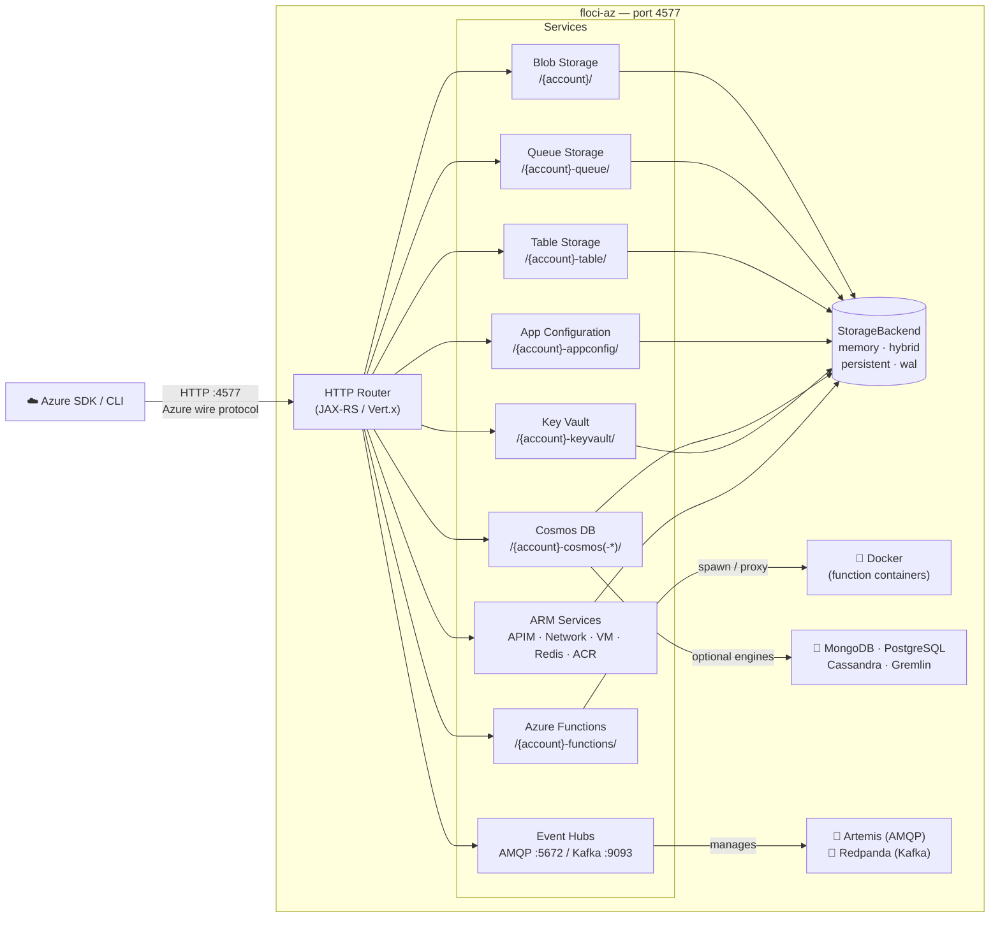

# Floci-AZ

<p align="center">
  
</p>

<p align="center"><em>Ligero, esponjoso y siempre gratuito</em></p>

---

Floci-AZ es un emulador local de servicios de Azure rápido, gratuito y de código abierto — que ofrece Blob Storage, Queues, Tables, Azure Functions, App Configuration, Cosmos DB (todas las APIs), Key Vault, Event Hubs, API Management, Virtual Network, Virtual Machines, Azure Cache for Redis y Azure Container Registry en un único binario nativo.

## ¿Por qué floci-az?

| | floci-az | [Azurite](https://github.com/Azure/Azurite) | [Functions Core Tools](https://github.com/Azure/azure-functions-core-tools) |
|---|---|---|---|
| Blob Storage | ✅ | ✅ | ❌ |
| Queue Storage | ✅ | ✅ | ❌ |
| Table Storage | ✅ | ✅ | ❌ |
| Azure Functions | ✅ | ❌ | ✅ |
| App Configuration | ✅ | ❌ | ❌ |
| Cosmos DB (SQL API) | ✅ | ❌ | ❌ |
| Cosmos DB (MongoDB / PostgreSQL / Cassandra / Gremlin / Table) | ✅ | ❌ | ❌ |
| Key Vault | ✅ | ❌ | ❌ |
| Event Hubs | ✅ | ❌ | ❌ |
| Tiempo de arranque | **<100ms** (imagen nativa) | Moderado | Rápido |
| Binario nativo | ✅ | ❌ | ✅ |
| Puerto unificado (4577) | ✅ | ❌ | ❌ |
| Modos de almacenamiento por servicio | ✅ | ❌ | ❌ |
| Persistencia WAL / híbrida | ✅ | ❌ | ❌ |
| Licencia | **MIT** | MIT | MIT |

## Resumen de arquitectura



## Servicios compatibles

| Servicio | Enrutamiento | Operaciones destacadas |
|---|---|---|
| **Blob Storage** | `/{account}/` | Crear/eliminar contenedores, subir/descargar/eliminar blobs, listar blobs |
| **Queue Storage** | `/{account}-queue/` | Crear/eliminar colas, enviar/recibir/inspeccionar/eliminar mensajes, tiempo de espera de visibilidad |
| **Table Storage** | `/{account}-table/` | Crear/eliminar tablas, insertar/obtener/actualizar/upsert/eliminar entidades, listar entidades |
| **Azure Functions** | `/{account}-functions/` | Desplegar e invocar funciones activadas por HTTP (node, python, java, dotnet); pool de contenedores en caliente |
| **App Configuration** | `/{account}-appconfig/` | Key-values, etiquetas, feature flags, instantáneas, revisiones, bloqueos, ETags |
| **Cosmos DB (NoSQL)** | `/{account}-cosmos/` | Bases de datos, contenedores, CRUD de documentos + dialecto SQL completo — integrado, siempre activo, sin Docker |
| **Motores de Cosmos DB** | `/{account}-cosmos-{api}/` | MongoDB · PostgreSQL · Cassandra · Gremlin (respaldados por Docker, opt-in) · Table · NoSQL (integrado, opt-in) |
| **Key Vault** | `/{account}-keyvault/` | CRUD de secretos, versionado, eliminación suave, actualización de propiedades |
| **Event Hubs** | AMQP `:5672` / Kafka `:9093` | AMQP 1.0 (sidecar Artemis), compatible con Kafka (Redpanda, opt-in) |
| **API Management** | Ruta ARM + `/{account}-apim/` | APIs, operaciones, productos, suscripciones, enrutamiento de gateway, subconjunto de políticas |
| **Virtual Network** | Ruta ARM (`Microsoft.Network`) | VNets, subredes, NICs, IP públicas, NSGs para Terraform/OpenTofu y dependencias de VM |
| **Virtual Machines** | Ruta ARM (`Microsoft.Compute`) | Ciclo de vida de VM, acciones de encendido, instanceView; plano de control simulado |
| **Azure Cache for Redis** | Ruta ARM (`Microsoft.Cache`) | CRUD de caché, claves, contenedores compatibles con Redis reales o modo simulado |
| **Azure Container Registry** | Ruta ARM (`Microsoft.ContainerRegistry`) | CRUD de registro, credenciales, soporte de push/pull del Docker Registry V2 |

## Inicio rápido

```yaml title="docker-compose.yml"
services:
  floci-az:
    image: floci/floci-az:latest
    ports:
      - "4577:4577"
    volumes:
      - ./data:/app/data
      - /var/run/docker.sock:/var/run/docker.sock  # required for Azure Functions
```

```bash
docker compose up -d
```

Todos los servicios están disponibles de inmediato en `http://localhost:4577`.

[Comenzar →](getting-started/quick-start.md){ .md-button .md-button--primary }
[Ver servicios →](services/index.md){ .md-button }