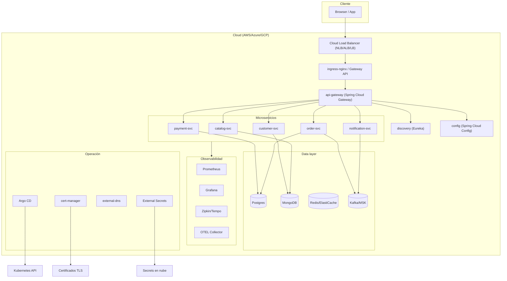

# Plan — Despliegue E-commerce Microservicios en Kubernetes (Trabajo Práctico)

> Objetivo: crear un despliegue completo de una plataforma e-commerce basada en microservicios sobre Kubernetes, desplegable en **AWS, Azure o GCP** mediante IaC (Terraform/Pulumi) y gestionado con **GitOps** (Argo CD/Flux). Este documento es el plan de diseño: estructura, arquitectura, fases y decisiones.

---

## 1. Repositorios de referencia (base)

| Repositorio | Qué aporta | Cómo lo usamos |
| --- | --- | --- |
| [walidhabbach/Ecommerce-Microservice-Kubernetes](https://github.com/walidhabbach/Ecommerce-Microservice-Kubernetes) | **E-commerce de referencia**: 8 microservicios Spring Boot, API Gateway, Eureka (discovery), Spring Cloud Config, Kafka/Zookeeper, Postgres/MongoDB, Prometheus/Grafana/Zipkin, Argo CD, Terraform AKS | Base funcional: servicios, dominio de negocio, manifests de ejemplo y arquitectura. Lo adaptamos a estructura multi-cloud + GitOps moderna |
| [kubernetes/examples](https://github.com/kubernetes/examples) | **Manifiestos canónicos** del proyecto Kubernetes (guestbook, sock shop, DBs, etc.) | Patrones de referencia para manifests correctos (volume, headless service, etc.) |
| [pulumi/examples](https://github.com/pulumi/examples) | **Multi-cloud IaC** en Pulumi (AWS/Azure/GCP) | Alternativa/paralelo de IaC: módulos por cloud provider |
| [kelseyhightower/kubernetes-the-hard-way](https://github.com/kelseyhightower/kubernetes-the-hard-way) | **Entender Kubernetes desde cero**: TLS, kubeconfigs, etcd, control plane a mano | Base teórica del trabajo práctico: justificación de componentes al profesor |

---

## 2. Estructura final del repositorio

```
<repo-root>/
├─ .github/                      # CI/CD (GitHub Actions) + secret scanning, codeowners
├─ .gitlab-ci.yml                # (alternativa) GitLab CI
├─ .opencode/                    # Configs de tu agente local/IA (si aplica)
│
├─ infra/                        # Infra "base" del cluster (IaC)
│   ├─ terraform/                # Cloud resources: VPC, subnets, SG, IAM, RDS, ElastiCache, MSK/Confluent, ACR/ECR/GCR, DNS, certs
│   │   ├─ modules/
│   │   │   ├─ networking/
│   │   │   ├─ eks/
│   │   │   ├─ aks/
│   │   │   ├─ gke/
│   │   │   ├─ databases/
│   │   │   └─ streaming/
│   │   ├─ envs/
│   │   │   ├─ dev/
│   │   │   ├─ staging/
│   │   │   └─ prod/
│   │   └─ backend.tf            # state remoto (S3/OCI/Bucket GCS)
│   └─ pulumi/                   # (opcional) misma idea pero con Pulumi
│
├─ cluster/                      # Componentes del cluster (GitOps)
│   ├─ base/                     # Herramientas comunes del cluster
│   │   ├─ namespaces/
│   │   ├─ cert-manager/
│   │   ├─ external-dns/
│   │   ├─ ingress-nginx/
│   │   ├─ argocd/ or flux/      # GitOps controller
│   │   ├─ sealed-secrets/ or external-secrets/ # Secrets management
│   │   ├─ kyverno/ or gatekeeper/ # Políticas (admission, seguridad)
│   │   ├─ keda/                 # Autoscaling basado en eventos (Kafka, SQS, etc.)
│   │   ├─ node-feature-discovery/ # Si usas GPU/SIMD (opcional)
│   │   └─ monitoring/
│   │       ├─ kube-prometheus-stack/
│   │       ├─ opentelemetry-collector/
│   │       ├─ loki/ or opensearch/ # Logs (opcional)
│   │       └─ tempo/ or jaeger/   # Traces (complementa OTEL)
│   └─ overlays/                 # Per-env: diferencias por namespace/region/cloud
│       ├─ dev/
│       ├─ staging/
│       └─ prod/
│
├─ services/                     # Microservicios (cada svc tiene su propia app + k8s manifests)
│   ├─ api-gateway/              # NGINX Ingress / Spring Cloud Gateway
│   │   ├─ src/
│   │   └─ k8s/
│   │       ├─ base/
│   │       └─ overlays/
│   ├─ auth/                     # Keycloak
│   ├─ catalog-svc/              # (product)
│   ├─ cart-svc/
│   ├─ checkout-svc/
│   ├─ order-svc/
│   ├─ payment-svc/
│   ├─ notification-svc/
│   ├─ search-svc/
│   ├─ recommendation-svc/
│   ├─ inventory-svc/
│   ├─ shipping-svc/
│   ├─ returns-svc/
│   ├─ analytics-svc/
│   └─ bff-web/                  # Backend-for-front
│
├─ data/                         # "Data layer"
│   ├─ postgres/
│   ├─ redis/
│   └─ kafka/
│
├─ observability/                # Dashboards, reglas y configs observability-as-code
│   ├─ dashboards/               # Grafana JSONs
│   ├─ alerts/                   # PrometheusRules / AlertmanagerConfig
│   ├─ otel-collector/
│   └─ slo/
│
├─ security/                     # Security-as-code
│   ├─ rbac/
│   ├─ networkpolicies/
│   ├─ pod-security/
│   ├─ image-scanning/
│   └─ secrets/
│
├─ scripts/                      # Utilidades: seed DB, migraciones, reset, lint
├─ docs/                         # ADRs, diagramas, runbooks
│   ├─ adr/
│   ├─ diagrams/
│   └─ runbooks/
├─ tests/                        # Contract, e2e, load
├─ codeowners
└─ README.md
```

---

## 3. Arquitectura objetivo



---

## 4. Visiones por capa

### 4.1 Microservicios (dominio e-commerce)

Adaptamos los servicios reales de [walidhabbach](https://github.com/walidhabbach/Ecommerce-Microservice-Kubernetes): API Gateway, Config + Discovery (Spring Cloud), y los servicios de negocio. La lista puede recortarse según alcance del TP:

| Servicio | Función | Persistencia | Referencia |
| --- | --- | --- | --- |
| `api-gateway` | Ruteo, auth JWT, CORS, rate limit | - | walidhabbach |
| `config-service` | Config centralizada (Spring Cloud Config) | Git backend | walidhabbach |
| `discovery-service` | Registro/detección (Eureka) | - | walidhabbach |
| `catalog-svc` (product) | Catálogo de productos | MongoDB / Postgres | walidhabbach |
| `cart-svc` | Carrito de compras | Redis | propuesto |
| `order-svc` | Pedidos | Postgres | walidhabbach |
| `payment-svc` | Pagos | Postgres | walidhabbach |
| `notification-svc` | Notificaciones (email vía Kafka) | MongoDB/Kafka | walidhabbach |
| `customer-svc` | Clientes | MongoDB | walidhabbach |
| `bff-web` | BFF para frontend (opcional) | - | propuesto |

**Regla de oro**: un servicio = un `k8s/base` + overlays por env, con `Deployment`, `Service`, `HPA`, `PDB`, `PodDisruptionBudget`, `probes`, `securityContext`, `ServiceAccount` dedicado y `NetworkPolicy` de mínimos privilegios.

### 4.2 Data layer

| Componente | Opción in-cluster | Opción gestionada |
| --- | --- | --- |
| Postgres | CloudNativePG / patroni | RDS / Cloud SQL / Azure Database |
| MongoDB | StatefulSet manual (como walidhabbach) | Atlas / Cosmos DB |
| Redis / Valkey | Helm chart | ElastiCache / Memorystore / Azure Cache |
| Kafka | Strimzi / Helm chart | MSK / Confluent / Event Hubs |

Decisiones:
- **TP (presupuesto cero)**: in-cluster con Helm charts → funciona en minikube/kind en local.
- **Demo en nube**: gestionado (más caro pero más realista); RDS + ElastiCache + MSK/Confluent.

### 4.3 [infra/terraform] (IaC)

- **`modules/`**: módulos por capa y por proveedor: `networking` (VPC/subnets/SG), `eks`/`aks`/`gke`, `databases`, `streaming`, `registry` (ECR/ACR/GCR).
- **`envs/`**: `dev/`, `staging/`, `prod/` — cada entorno es una instancia de los módulos con sus variables.
- **`backend.tf`**: state remoto (S3/OBS/GCS bucket según cloud).
- **Portabilidad**: la filosofía de [pulumi/examples](https://github.com/pulumi/examples) (mismo stack en 3 clouds) se replica con módulos Terraform por proveedor.

### 4.4 [cluster/] (GitOps de cluster)

- `base/`: herramientas comunes (ingress-nginx, cert-manager, external-dns, argon/flux, kyverno, keda, monitoring) usando **Helm + Kustomize**.
- `overlays/`: diferencias por entorno (dev/staging/prod).
- GitOps: Argo CD **app of apps** — un `Application` raíz apunta al repo y crea todos los componentes; el repo es la fuente de verdad.

### 4.5 [observability/]

- **Metrics**: kube-prometheus-stack (Prometheus + Grafana + Alertmanager).
- **Traces**: OTEL Collector → Tempo o Zipkin (walidhabbach usa Zipkin).
- **Logs** (opcional): Loki.
- Dashboards y alerts como código (Grafana JSON, PrometheusRules).

### 4.6 [security/]

- **RBAC** por namespace/servicio.
- **NetworkPolicies**: default-deny + allow por flujo.
- **Pod Security**: PSA `restricted`, rootless, `readOnlyRootFilesystem`, `securityContext`.
- **Secrets**: External Secrets Operator / Sealed Secrets (nunca secrets en el repo).
- **Supply chain** (opcional): Trivy/SBOM/Cosign + firma de imágenes.

### 4.7 [CI/CD]

- GitHub Actions (o GitLab CI): build → test → scan (Trivy) → push (.env de imagen) → **promoter** el `kustomization` en `cluster/overlays/{env}`.
- Argo CD/Flux detecta el cambio en Git y despliega → GitOps.

---

## 5. Multi-cloud: AWS ↔ Azure ↔ GCP

| Capa | AWS | Azure | GCP |
| --- | --- | --- | --- |
| Cluster | EKS | AKS | GKE |
| Registro | ECR | ACR | GCR/Artifact Registry |
| Postgres | RDS/Aurora | Azure Database for PostgreSQL | Cloud SQL |
| Redis | ElastiCache | Azure Cache for Redis | Memorystore |
| Streaming | MSK | Event Hubs | Confluent Cloud / Pub/Sub |
| State backend | S3 | Storage Account | GCS |
| DNS | Route 53 | Azure DNS | Cloud DNS |

Estrategia:
1. `infra/terraform/modules/{eks,aks,gke}`: mismo contrato, distinto proveedor.
2. `cluster/overlays/{cloud-env}`: annotations/load balancer class, secret backends distintos.
3. Un **GitOps repo por cluster set** (o ambiente por cloud) — el mismo `services/` se reutiliza; los overlays cambian.

---

## 6. Fases de implementación

| Fase | Entregable | Depende de |
| --- | --- | --- |
| **0. Fundaciones** | Repo inicial, estructura, `README`, boilerplate IaC + GitOps | - |
| **1. Local dev** | minikube/kind + services en local + data layer in-cluster | 0 |
| **2. IaC** | Terraform modules `networking` + cluster (EKS/AKS/GKE) + registros | 1 |
| **3. Cluster platform** | ingress-nginx, cert-manager, external-dns, Argo CD/Flux, kyverno, keda, monitoring base | 2 |
| **4. Data layer** | Postgres, Redis, Kafka (in-cluster → gestionado) | 3 |
| **5. Microservicios** | 8+ servicios con manifests + HPA/PDB/NetworkPolicy | 4 |
| **6. Observabilidad** | Prometheus/Grafana/Zipkin/OTEL, dashboards, alerts, SLOs | 5 |
| **7. Seguridad** | RBAC, PSA, NetworkPolicies default-deny, External Secrets, Trivy | 5 |
| **8. CI/CD** | GitHub Actions pipeline + GitOps sync automático | 6, 7 |
| **9. Docs del TP** | ADRs, runbooks, diagramas, informe (justificación con kubernetes-the-hard-way) | 8 |

---

## 7. Decisiones de diseño (ADR resumen)

1. **GitOps primero**: Argo CD *app of apps*; el repo es la única fuente de verdad.
2. **Helm para componentes de plataforma** (charts oficiales/bitnami), **Kustomize para servicios propios** → balance estándar de la industria.
3. **Secrets siempre externos** (External Secrets Operator) — no hay secrets en Git.
4. **HPA por CPU/mem en todos los servicios**; **KEDA** para escalar por lag de Kafka.
5. **Resiliencia**: probes de readiness/liveness/startup, PDB, anti-affinity, resources requests/limits.
6. **Red**: ingress-nginx como gateway L7 (con option Gateway API), external-dns, cert-manager.
7. **Políticas**: Kyverno para enforce (labels, image registry permitido, recursos).
8. **Observabilidad**: OTEL Collector como pipeline único; métricas+traces correlacionados.
9. **Portabilidad**: módulos Terraform por proveedor + overlays por cloud en Kustomize.
10. **Presupuesto TP**: por defecto corre en local/minikube; cloud demo opcional con free tiers.

---

## 8. Alcance para el trabajo práctico (recorte razonable)

Si el TP lo pide, se puede **reducir** sin perder el punto:

- **Microservicios mínimos**: `api-gateway` + `discovery` + `config` + `catalog-svc` + `order-svc` + `payment-svc` + `notification-svc` (7, como walidhabbach). Opcional: `customer-svc`.
- **Data layer mínima**: Postgres (order/payment) + Mongo (catalog) + Kafka (notification) — como el repo original.
- **Cloud default**: AKS (ya Terraformizado en walidhabbach) o local minikube. EKS/GKE como ejercicio de portabilidad.
- **GitOps obligatorio**: Argo CD (UI fácil de demostrar al profesor).
- **Observabilidad obligatoria**: Prometheus + Grafana + Zipkin.
- **Seguridad obligatoria**: RBAC + NetworkPolicy default-deny + PSA restricted en al menos un namespace.

---

## 9. Entregables finales

1. Repo completo con la estructura anterior.
2. Microservicios compilando y desplegándose (con imágenes propias en el registry).
3. Cluster reproducible con Terraform (o local con scripts).
4. Argo CD desplegando en GitOps.
5. Dashboards Grafana + alertas activas.
6. Manifiestos con buenas prácticas (probes, HPA, PDB, securityContext, NetworkPolicy).
7. Informe/docs: ADR, diagramas, runbook, justificación de componentes (the-hard-way).
8. Demo final (grabación o live).

---

## 10. Siguientes pasos inmediatos

1. Aprobar alcance (completo vs. recorte TP).
2. Fase 0: crear estructura del repo + `README` + `.gitignore` + codeowners.
3. Fase 0.5: `sdd-init` en el repo de trabajo y explorar el código de walidhabbach en detalle (imágenes, Dockerfiles, configuración Spring Cloud) para clonar/adaptar servicios.